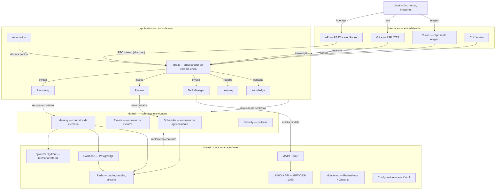
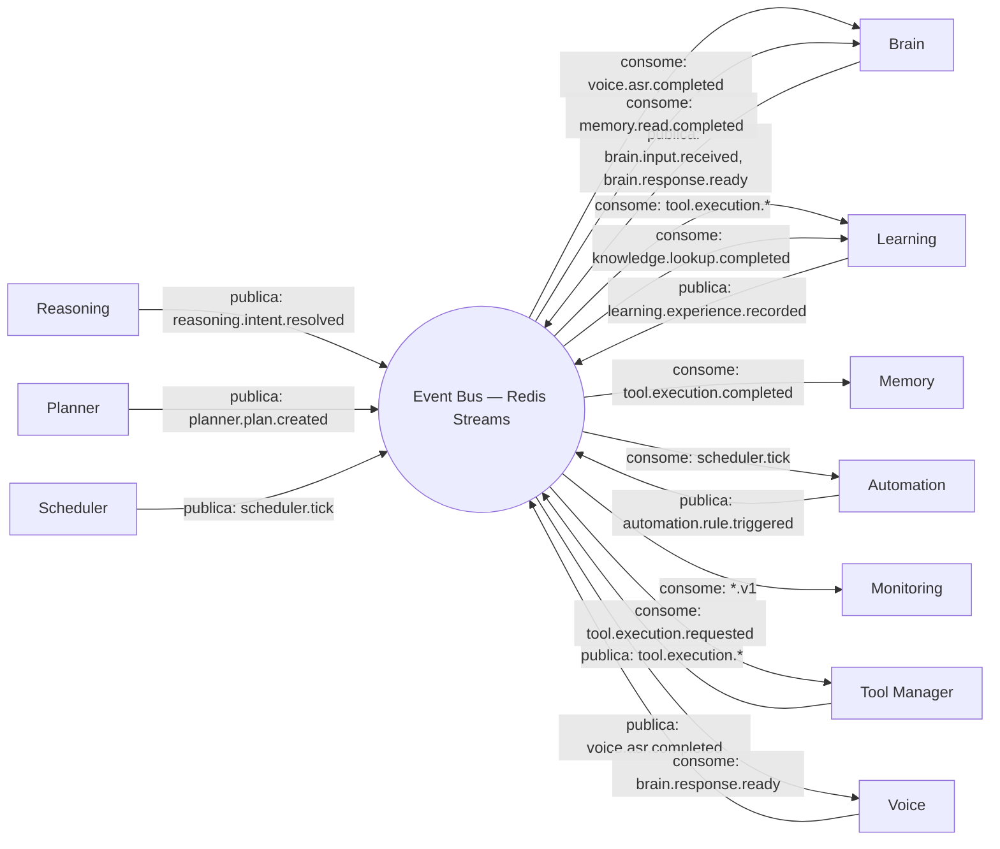
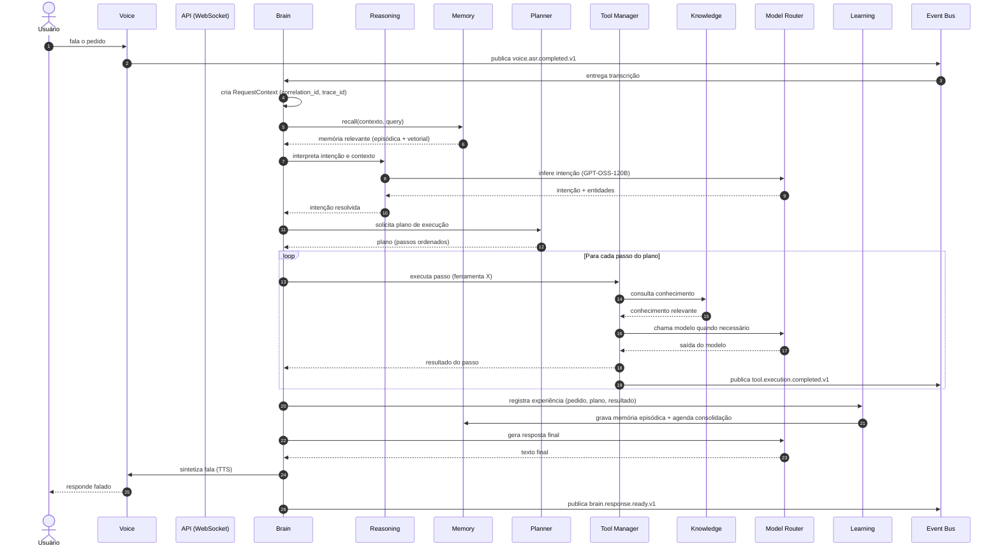

# NEGÃO AI — Documento de Arquitetura de Referência (v0.1)

*Arquiteto Principal — NEGÃO AI. Escopo: design. Nenhuma implementação incluída.*

---

## 1. Arquitetura de Referência e o Conceito de "Cérebro Único"

### 1.1 Visão Geral em Camadas (Clean Architecture)

O monorepo segue **Clean Architecture** com 4 camadas. Toda regra de dependência aponta **para dentro** (em direção ao `domain`):

```
interfaces  →  application  →  domain  ←  infrastructure
   (entrada)      (casos)      (contratos)   (implementações)
```

| Camada | Papel | O que vive aqui |
|---|---|---|
| **interfaces** | Entrada/saída com o mundo exterior | API REST/WebSocket, CLI, captura de voz (ASR), captura de imagem, saída de áudio (TTS) |
| **application** | Casos de uso, orquestração, ciclo de vida do pedido | Brain, Planner, Reasoning, Tool Manager, Learning, Knowledge, Automation |
| **domain** | Entidades, value objects e **contratos (ports)** — livre de framework | Memory (contratos), Events (contratos), Scheduler (contratos), Security (políticas) |
| **infrastructure** | Adaptadores que implementam os ports do domain | PostgreSQL, Redis, pgvector/Qdrant, Model Router (NVIDIA API + GPT-OSS-120B), Monitoring, Configuration |

### 1.2 Os 17 Módulos nas Camadas

| Camada | Módulos |
|---|---|
| **interfaces** | API, Voice, Vision |
| **application** | Brain, Planner, Reasoning, Tool Manager, Learning, Knowledge, Automation |
| **domain** | Memory, Events, Scheduler, Security |
| **infrastructure** | Database, Monitoring, Configuration |

> Regra de distribuição: um módulo pode ter código em mais de uma camada (ex.: Voice tem `interfaces` para captura e `infrastructure` para o adaptador ASR/TTS), mas **cada módulo tem uma responsabilidade única** (seção 3).

### 1.3 O Conceito de "Cérebro Único"

NEGÃO AI é **uma** inteligência. Os módulos são **órgãos do mesmo cérebro**, não agentes. Não há personalidade, memória ou agenda própria em nenhum módulo — não há `system prompt` por módulo, não há loop autônomo por módulo, não há estado "de propósito" fora da memória única.

**Regra de ouro:** *nenhum módulo chama outro módulo diretamente.* Toda comunicação passa por exatamente um de dois caminhos:

1. **RPC interno síncrono (orquestração central)** — somente o **Brain** invoca os módulos de `application` in-process (chamada de função via interface Python dentro do mesmo processo). O Brain é o único que enxerga o ciclo completo: `entrada → contexto → raciocínio → plano → execução → aprendizado → resposta`.
2. **Eventos assíncronos (Event Bus)** — qualquer módulo publica eventos e consome eventos que lhe interessam. Produtor e consumidor **não se conhecem**: acoplamento zero, feito via contrato de evento (`type` + versão) no `domain`.

**Por que isso garante o cérebro único:**
- Módulos não têm "vontade" — só executam quando o Brain (ou um evento que o Brain registrou) os aciona.
- Memória única: todos os módulos leem/escrevem **a mesma** Memory (pgvector + PostgreSQL + Redis), através dos contratos dela. Não existe memória privada por módulo.
- Um `RequestContext` (trace_id, correlation_id, user_id, session_id, deadline) é propagado por toda a execução — o cérebro trata o pedido como **um único processo mental**, mesmo que toque 10 módulos.

### 1.4 Padrões de Comunicação Interna

| Padrão | Uso | Quando usar |
|---|---|---|
| **RPC interno síncrono** | Brain → módulos de application (in-process) | Quando a resposta do módulo é necessária para continuar (raciocínio, plano, tool) |
| **Evento assíncrono** | Qualquer módulo → Event Bus | Quando o consumidor não bloqueia o produtor (aprendizado, monitoramento, consolidação de memória) |
| **Ports & Adapters** | domain ↔ infrastructure | Toda I/O externa (DB, Redis, LLM, áudio) — o domain define a interface, infrastructure implementa |
| **Context Object** | propagação transversal | `RequestContext` via ContextVar no processo + `trace_id`/`correlation_id` nos eventos |

**Fluxo típico de sincronicidade:** o caminho *crítico* (Brain → Reasoning → Planner → Tool Manager → Brain) é **síncrono**; tudo que é *posterior/paralelo* (Learning, consolidação de memória, métricas) é **assíncrono via eventos**. Isso dá resposta rápida ao usuário sem perder o aprendizado.

---

## 2. Estrutura de Diretórios do Monorepo

```
negao-ai/
├── backend/                                  # API + cérebro (Python 3.13, FastAPI)
│   ├── app/
│   │   ├── main.py                           # Bootstrap: FastAPI, lifespan, DI, WebSocket
│   │   ├── core/                             # Núcleo do cérebro único (transversal)
│   │   │   ├── brain/                        # Brain: orquestrador do ciclo request→response
│   │   │   │   ├── orchestrator.py           # Máquina de estados do pedido
│   │   │   │   └── pipeline.py               # Etapas: contexto→raciocínio→plano→execução→aprendizado
│   │   │   ├── context.py                    # RequestContext (trace_id, correlation_id…)
│   │   │   ├── event_bus.py                  # Contratos do barramento (port)
│   │   │   └── di.py                         # Composição/Injeção de dependência raiz
│   │   ├── modules/                          # ★ Os 17 módulos — um por pasta ★
│   │   │   ├── brain/                        # #1 Brain (núcleo — vive em core/, portais aqui)
│   │   │   ├── memory/                       # #2 Memory (domain: contratos | infra: adapters)
│   │   │   ├── knowledge/                    # #3 Knowledge
│   │   │   ├── learning/                     # #4 Learning
│   │   │   ├── planner/                      # #5 Planner
│   │   │   ├── reasoning/                    # #6 Reasoning
│   │   │   ├── tool_manager/                 # #7 Tool Manager
│   │   │   ├── voice/                        # #8 Voice (ASR/TTS — interfaces + infra)
│   │   │   ├── vision/                       # #9 Vision (visão computacional)
│   │   │   ├── automation/                   # #10 Automation (regras "se…então")
│   │   │   ├── scheduler/                    # #11 Scheduler (agendamento)
│   │   │   ├── events/                       # #12 Events (barramento: Redis Streams)
│   │   │   ├── api/                          # #13 API (controllers REST/WS da interface pública)
│   │   │   ├── database/                     # #14 Database (PostgreSQL, Alembic, sessões)
│   │   │   ├── security/                     # #15 Security (auth, autorização, saneamento)
│   │   │   ├── monitoring/                   # #16 Monitoring (métricas, logs, traços)
│   │   │   └── configuration/                # #17 Configuration (env, vault, reload)
│   │   ├── interfaces/                       # Controllers globais: REST, WS, CLI, uploads
│   │   ├── application/                      # Use cases globais (não específicos de módulo)
│   │   ├── domain/                           # Entidades e contratos do cérebro (framework-free)
│   │   └── infrastructure/                   # Adapters globais: db, redis, qdrant, model_router
│   ├── migrations/                           # Alembic (versões de schema do PostgreSQL)
│   ├── tests/                                # Unit + integração (por módulo)
│   ├── pyproject.toml
│   └── Dockerfile
├── frontend/                                 # Next.js + React + Tailwind + TypeScript
│   ├── app/                                  # App Router (páginas e rotas de API-BFF)
│   ├── components/                           # UI (chat, wave de voz, painel)
│   ├── lib/                                  # Cliente WebSocket, gestão de áudio, auth
│   ├── public/
│   ├── package.json
│   └── Dockerfile
├── infra/                                    # Deploy e operação
│   ├── docker/
│   │   ├── compose/                          # dev.yml · prod.yml · observability.yml
│   │   └── images/                           # Dockerfiles especializados (se houver)
│   ├── nginx/                                # Reverse proxy, TLS, HTTP/2, WebSocket upgrade
│   ├── k8s/                                  # (futuro) manifests para migração K8s
│   ├── scripts/                              # deploy.sh, backup.sh, restore.sh, init-db.sh
│   └── .env.example
├── docs/
│   ├── architecture/                         # Este documento + detalhamentos
│   ├── contracts/                            # Catálogo de eventos, payloads e versões
│   ├── decisions/                            # ADRs (Architecture Decision Records)
│   └── api/                                  # OpenAPI, guias de integração
├── tests/                                    # e2e ponta a ponta (Playwright/Cypress + API)
└── Makefile                                  # Atalhos: make dev, make test, make deploy
```

**Estrutura interna padrão de cada módulo** (todos seguem o mesmo esqueleto, ex. `tool_manager/`):

```
app/modules/tool_manager/
├── domain/          # Ports/contratos do módulo (ToolPort, ToolResult)
├── application/     # Casos de uso: executar, registrar, listar ferramentas
├── infrastructure/  # Adapters: HTTP tools, shell tools, SDKs externos
├── events.py        # Declaração dos eventos que publica e consome
└── router.py        # Contrato de exposição ao Brain (função pública única)
```

> O `router.py` de cada módulo é a **única porta de entrada do Brain** para aquele módulo — reforça a regra de ouro e dá um ponto único de auditoria.

---

## 3. Definição dos 17 Módulos

### 3.1 Tabela de Responsabilidades e Fronteiras

| # | Módulo | Camada(s) | Responsabilidade única | Fronteira (faz / não faz) |
|---|---|---|---|---|
| 1 | **Brain** | application | Orquestrar o ciclo completo de um pedido; manter o estado mental do cérebro único | Faz: recebe input, monta contexto, delega, compõe resposta, decide aprendizado. **Não faz:** raciocínio de domínio nem I/O externa |
| 2 | **Memory** | domain + infrastructure | Ser a **única** memória do cérebro: episódica (vetorial), semântica (fatos), procedimental (rotinas) e de trabalho (curto prazo) | Faz: recall/registro/consolidação. **Não faz:** decidir o que é importante (isso é do Learning) |
| 3 | **Knowledge** | application | Gerenciar base de conhecimento estática/curada (documentos, FAQs, manuais) consultável pelo Brain | Faz: lookup, chunking, indexação. **Não faz:** memória pessoal do usuário (isso é da Memory) |
| 4 | **Learning** | application | Extrair lições da execução: registrar experiências, gerar resumos, propor consolidação na memória | Faz: avalia resultado × intenção, feedback. **Não faz:** alterar memória sozinho — sempre via Memory |
| 5 | **Planner** | application | Transformar intenção em plano de passos executáveis e replanejar em falha | Faz: decomposição, ordenação, replan (limite de tentativas). **Não faz:** executar ferramentas |
| 6 | **Reasoning** | application | Interpretação: intenção, entidades, contexto implícito, chamada ao modelo base | Faz: inferência, análise de ambiguidade. **Não faz:** tomar decisões de execução |
| 7 | **Tool Manager** | application | Catalogar, resolver e executar ferramentas; encapsular efeitos externos | Faz: registro de tools, execução com timeout/retry, sanitização de resultado. **Não faz:** decidir o plano |
| 8 | **Voice** | interfaces + infrastructure | Entrada de fala (ASR) e saída de voz (TTS) | Faz: transcrição, síntese, VAD. **Não faz:** interpretar o texto (é do Reasoning) |
| 9 | **Vision** | interfaces + infrastructure | Análise de imagens (captura e descrição/OCR) | Faz: captura, OCR, descrição. **Não faz:** decidir ação sobre a imagem |
| 10 | **Automation** | application | Executar rotinas automáticas "se-então" disparadas por eventos/scheduler | Faz: avaliar regras, disparar pedidos no Brain. **Não faz:** criar regras sozinho |
| 11 | **Scheduler** | domain + infrastructure | Agendar tarefas temporais (cron-like) e acordar o Brain | Faz: agendamento, cron, lembretes. **Não faz:** conteúdo das tarefas |
| 12 | **Events** | domain + infrastructure | Barramento de eventos: streams, entrega, DLQ, deduplicação | Faz: publish/subscribe, versionamento. **Não faz:** lógica de negócio |
| 13 | **API** | interfaces | Expor a interface pública REST/WebSocket e autenticar conexões | Faz: controllers, DTOs, rate limit. **Não faz:** regras de negócio |
| 14 | **Database** | infrastructure | Gerenciar PostgreSQL: conexões, sessões, migrações Alembic | Faz: pool, transações, migrations. **Não faz:** modelagem de memória (é da Memory) |
| 15 | **Security** | domain + infrastructure | Autenticação, autorização, sanitização, segredos | Faz: JWT/API key, RBAC, validação de entrada. **Não faz:** decidir o conteúdo das respostas |
| 16 | **Monitoring** | infrastructure | Métricas, logs estruturados, tracing distribuído, alertas | Faz: OpenTelemetry, Prometheus, logs. **Não faz:** interferir no fluxo |
| 17 | **Configuration** | infrastructure | Configuração central: env, vault, reload sem restart | Faz: validação de config, secrets. **Não faz:** regras de negócio |

### 3.2 Regras de Dependência (obrigatórias)

1. **Só dependência para dentro:** `interfaces → application → domain`; `infrastructure → domain` (implementa ports).
2. **Módulo nunca importa outro módulo.** Acoplamento entre módulos só existe via: (a) eventos (Events), ou (b) chamada do Brain.
3. **O Brain é a única exceção estrutural:** ele pode invocar qualquer módulo de `application` — mas através do `router.py` público de cada um.
4. **Ports no domain, implementação na infrastructure:** um módulo com I/O externa define o port no próprio `domain/` e implementa no próprio `infrastructure/`.
5. **domain é framework-free:** entidades e contratos não importam FastAPI/SQLAlchemy/Redis.
6. **Exceções utilitárias (somente 2):** `Configuration` e `Monitoring` podem ser usados por qualquer camada/módulo, por serem transversais — com contratos estáveis.
7. **Eventos são contratos versionados** (`Events` no domain): publicar/consumir é a única forma de integração indireta permitida.

---

## 4. Comunicação entre Módulos — Event Bus

### 4.1 Modelo de Evento (Envelope)

Todo evento transporta o envelope padrão; o `payload` é livre por tipo:

```json
{
  "id": "uuid-v4",                       // idempotência do consumidor
  "type": "tool.execution.completed",    // nome estável (sem versão no nome)
  "version": 1,                          // versão do payload
  "producer": "tool_manager",            // módulo produtor
  "trace_id": "uuid",                    // toda a execução de um pedido
  "correlation_id": "uuid",              // cadeia de eventos de um pedido
  "parent_id": "uuid | null",            // evento que originou este (encadeamento)
  "user_id": "uuid | null",
  "session_id": "uuid | null",
  "occurred_at": "2026-08-05T14:23:00Z", // ISO-8601 UTC
  "payload": {}                          // contrato por type+version
}
```

### 4.2 Versionamento de Eventos

- Evento é identificado por `type` + `version` (ex.: `memory.written` v1).
- **Compatível (patch/minor):** adição de campo opcional no payload → mesma versão.
- **Quebra (major):** novo stream `type.v2`; produtores publicam **v1 e v2** por um período de transição definido (2 ciclos); consumidores antigos seguem consumindo v1 até migrar.
- Nenhum consumidor deve "adivinhar" campos fora do contrato publicado em `docs/contracts/`.

### 4.3 Garantias de Entrega

| Garantia | Política |
|---|---|
| Entrega | **At-least-once**; consumo idempotente via `id` (dedupe em Redis por 24h) |
| Ordem | Por **partition key = correlation_id** (ordem por pedido, não global) |
| Falha de consumo | Retry exponencial (máx. 5) → **DLQ** (dead-letter stream) → alerta no Monitoring |
| Retenção | 7 dias no Redis Streams; exportação diária para PostgreSQL (auditoria) |
| Infra v1 | **Redis Streams** (grupos de consumidores); contrato abstrai transporte — troca por Kafka/RabbitMQ na migração K8s sem quebrar produtores/consumidores |

### 4.4 Catálogo de Eventos (produtores → consumidores)

| Evento (`type`) | v | Produtor | Consumidores |
|---|---|---|---|
| `brain.input.received` | 1 | Brain | Monitoring |
| `brain.planning.started` | 1 | Brain | Monitoring |
| `brain.response.ready` | 1 | Brain | Voice, API, Monitoring |
| `voice.asr.completed` | 1 | Voice | Brain, Monitoring |
| `voice.tts.requested` | 1 | Brain | Voice, Monitoring |
| `vision.analysis.completed` | 1 | Vision | Brain, Monitoring |
| `reasoning.intent.resolved` | 1 | Reasoning | Brain, Learning |
| `planner.plan.created` | 1 | Planner | Brain, Scheduler, Monitoring |
| `planner.plan.failed` | 1 | Planner | Brain, Learning, Monitoring |
| `tool.execution.requested` | 1 | Brain | Tool Manager, Monitoring |
| `tool.execution.completed` | 1 | Tool Manager | Brain, Learning, Memory, Monitoring |
| `tool.execution.failed` | 1 | Tool Manager | Brain, Learning, Monitoring |
| `knowledge.lookup.completed` | 1 | Knowledge | Brain, Learning |
| `memory.read.completed` | 1 | Memory | Brain, Learning |
| `memory.written` | 1 | Memory | Learning, Monitoring |
| `learning.experience.recorded` | 1 | Learning | Memory, Monitoring |
| `automation.rule.triggered` | 1 | Automation | Brain, Scheduler |
| `scheduler.tick` | 1 | Scheduler | Automation, Monitoring |
| `security.auth.completed` | 1 | Security | Monitoring |
| `configuration.reload` | 1 | Configuration | todos os módulos (aplicação) |
| `monitoring.metric.published` | 1 | Monitoring | Monitoring |

---

## 5. Ciclo de Vida de um Pedido (Request → Resposta → Aprendizado)

**Etapas** (todas dentro de **um** RequestContext; o caminho crítico é síncrono, o aprendizado é assíncrono):

1. **Captura** — o usuário fala; Voice (ASR) transcreve e publica `voice.asr.completed` → Brain recebe.
2. **Contexto** — Brain cria `RequestContext` (correlation_id, trace_id) e faz **recall** na Memory (memória episódica/vetorial relevante ao usuário + contexto da sessão).
3. **Raciocínio** — Brain → Reasoning: interpreta intenção, entidades e ambiguidades (chamada ao Model Router/GPT-OSS-120B); publica `reasoning.intent.resolved`.
4. **Planejamento** — Brain → Planner: converte intenção em plano de passos; publica `planner.plan.created`.
5. **Execução** — para cada passo: Brain → Tool Manager → executa a ferramenta resolvida (consulta Knowledge, chama APIs/modelos); cada resultado volta ao Brain; publica `tool.execution.completed`/`failed`.
6. **Falha/Replanejamento** — em falha, Brain devolve ao Planner para replan (máx. 3 tentativas); exaurido, responde pedindo esclarecimento.
7. **Resposta** — Brain compõe a resposta final (Model Router), envia texto à Voice (TTS) e à API; publica `brain.response.ready`.
8. **Aprendizado (assíncrono, ao final)** — Brain publica a experiência; **Learning** avalia pedido × plano × resultado × feedback → **Memory** registra (episódica) e agenda consolidação (resumos, reforço de procedimentos) — sempre pela mesma Memory única.
9. **Observabilidade** — Monitoring captura trace/metrics do início ao fim.

---

## 6. Diagramas Mermaid

### (a) Visão geral — arquitetura em camadas



### (b) Comunicação entre módulos via Event Bus



### (c) Fluxo de processamento de um request ponta a ponta



### (d) Estrutura do monorepo

```mermaid
graph TD
    ROOT["negao-ai (monorepo)"]
    ROOT --> BACK["backend/ — FastAPI, Python 3.13"]
    ROOT --> FRONT["frontend/ — Next.js, React, TS"]
    ROOT --> INFRA["infra/ — Docker, nginx, k8s"]
    ROOT --> DOCS["docs/"]
    ROOT --> TESTS["tests/ — e2e"]

    BACK --> BAPP["app/"]
    BACK --> BMIG["migrations/ — Alembic"]
    BACK --> BTEST["tests/ — unit e integração"]
    BACK --> BPY["pyproject.toml"]

    BAPP --> BCORE["core/ — Brain, contexto, event bus, DI"]
    BAPP --> BMOD["modules/ — os 17 módulos"]
    BAPP --> BIF["interfaces/ — REST, WS, CLI"]
    BAPP --> BDOM["domain/ — entidades e contratos"]
    BAPP --> BINF["infrastructure/ — PostgreSQL, Redis, Qdrant, NVIDIA"]

    BMOD --> M01["brain/"]
    BMOD --> M02["memory/"]
    BMOD --> M03["knowledge/"]
    BMOD --> M04["learning/"]
    BMOD --> M05["planner/"]
    BMOD --> M06["reasoning/"]
    BMOD --> M07["tool_manager/"]
    BMOD --> M08["voice/"]
    BMOD --> M09["vision/"]
    BMOD --> M10["automation/"]
    BMOD --> M11["scheduler/"]
    BMOD --> M12["events/"]
    BMOD --> M13["api/"]
    BMOD --> M14["database/"]
    BMOD --> M15["security/"]
    BMOD --> M16["monitoring/"]
    BMOD --> M17["configuration/"]

    INFRA --> IDC["docker/compose/ — dev, prod, observability"]
    INFRA --> ING["nginx/ — reverse proxy, TLS"]
    INFRA --> IK8["k8s/ — migração futura"]
    INFRA --> ISC["scripts/ — deploy, backup, restore"]

    DOCS --> DA["architecture/"]
    DOCS --> DC["contracts/ — catálogo de eventos"]
    DOCS --> DD["decisions/ — ADRs"]
    DOCS --> DAP["api/ — OpenAPI"]
```



---

*Fim do relatório de arquitetura v0.1.*
