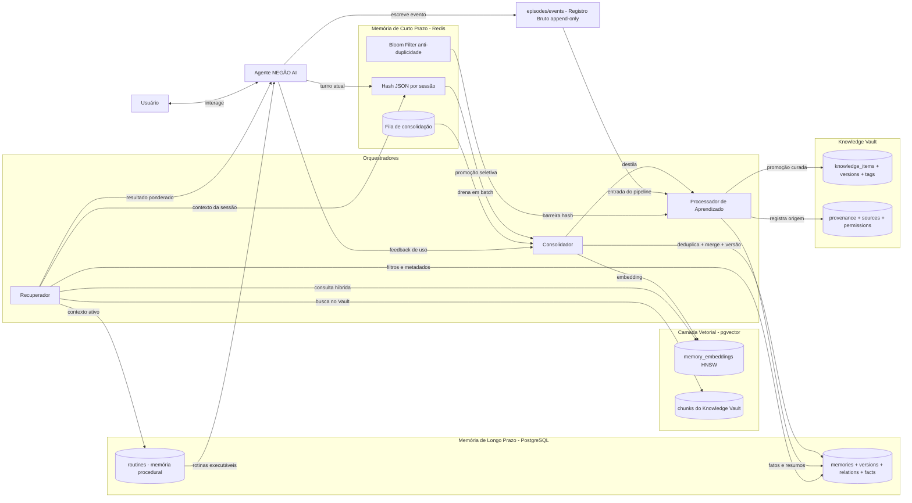
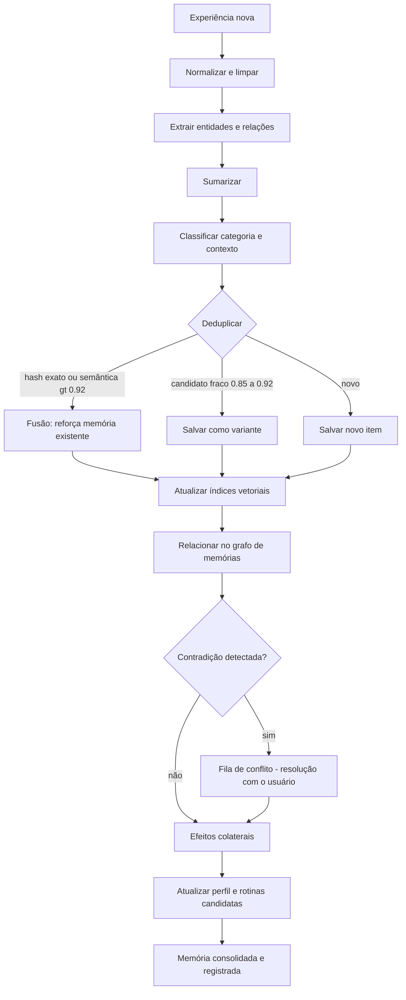
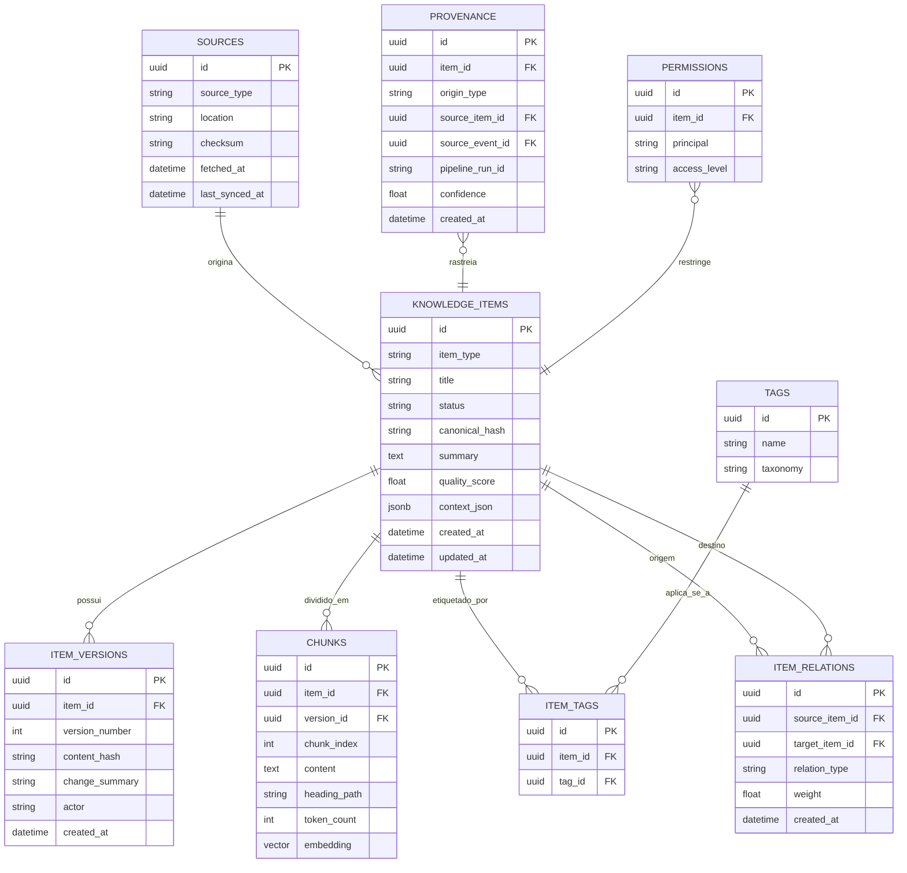

# NEGÃO AI — Arquitetura dos Subsistemas de Memória, Aprendizado Contínuo e Knowledge Vault

**Autor:** Arquiteto Principal — NEGÃO AI
**Data:** 2026-08-05
**Escopo:** Design de arquitetura (sem código de implementação)
**Stack de referência:** Python 3.13+, FastAPI, SQLAlchemy 2.x, Alembic, PostgreSQL 16+, Redis 7+, Docker Compose; Frontend Next.js/React/TypeScript.

---

## 0. Princípios de Arquitetura

1. **Um cérebro, uma memória.** Não existem memórias por usuário, por sessão ou por módulo — existe UMA instância de memória global, particionada por **categoria e contexto**, não por identidade.
2. **Registro bruto é imutável; conhecimento é curado.** Episódica é append-only (fonte da verdade). Conhecimento no Vault é derivado, versionado e passível de edição.
3. **Tudo o que é salvo tem: relevância, confiança, origem e versão.** Nenhuma memória existe sem esses quatro metadados mínimos.
4. **Aprendizado é assíncrono e por lote (batch).** Nada é "aprendido" no caminho crítico de uma resposta — o aprendizado ocorre em janelas de consolidação.
5. **Decadência é regra, não exceção.** Memória não usada perde relevância e é arquivada. O sistema nunca esquece de forma destrutiva sem política explícita.
6. **Deduplicação é a primeira lei da escrita.** Nenhum item entra no armazenamento sem passar pela checagem de duplicidade.

---

## 1. Visão Geral — Arquitetura dos Três Níveis de Memória

O NEGÃO AI opera com **três níveis de armazenamento cognitivo**, espelhando o modelo humano de memória:

| Nível | Tecnologia | Papel | Persistência |
|---|---|---|---|
| **Curto prazo (STM)** | Redis 7 | Buffer de trabalho ativo, contexto imediato da sessão, atenção | Volátil, TTL 24h (renovável) |
| **Longo prazo (LTM)** | PostgreSQL 16 | Fatos, episódios consolidados, rotinas, conhecimento estrutural | Durável, transacional (ACID) |
| **Vetorial (VS)** | pgvector (no PostgreSQL) | Busca semântica por similaridade sobre tudo o que foi consolidado | Durável, coluna `vector` |

Entre os níveis há três mecanismos orquestradores:

- **Consolidador (Consolidation Worker)** — promove STM → LTM, deduplica, cria relações.
- **Aprendiz (Learning Processor)** — pipeline de análise/sumarização/classificação de novas experiências.
- **Recuperador (Retriever)** — fusão ponderada de resultados dos três níveis para responder ao usuário.

---

## 2. SISTEMA DE MEMÓRIA

### 2.1 Memória de Curto Prazo (STM) — Redis

**Definição:** estado cognitivo ativo do assistente: sessão em andamento, últimos N turnos, entidades mencionadas, intenções pendentes, itens marcados como "lembre disso" aguardando consolidação.

**Formato (hash JSON):**
```json
{
  "id": "stm_8f3a…",
  "session_id": "sess_2026-08-05_0915",
  "type": "utterance|observation|intent|todo|salient_note",
  "content": "usuário informou que projeto x venceu o prazo",
  "entities": ["projeto:x", "prazo:venceu"],
  "salience_hint": 0.8,
  "created_at": 1784297700,
  "last_access_at": 1784298100
}
```

**Chaves Redis:**
- `negai:stm:{session_id}:items` — ZSET ordenado por saliência (para promoção).
- `negai:stm:{session_id}:queue` — LIST pendente de consolidação (RPOP pelo worker).
- `negai:stm:entity:{entidade}` — SET de itens que mencionam a entidade.
- `negai:stm:bloom` — Bloom filter de hashes recentes (primeira barreira de duplicidade).

**TTL:** padrão 24h com **sliding expiration** (acesso renova). Itens com `salience_hint >= 0.7` recebem extensão para 72h para garantir que a janela de consolidação os alcance. Itens de baixa saliência expiram naturalmente e desaparecem (equivalente ao "esquecimento de trabalho").

**Política de promoção para LTM** (ver seção 2.8): promoção ocorre quando **qualquer** condição abaixo é verdadeira:

1. Saliência ≥ 0.7 (importância explícita ou inferida).
2. Fim da sessão + saliência ≥ 0.4.
3. Reforço do usuário ("lembre disso", "importante", repetição).
4. Referência cruzada: o item está relacionado a ≥ 2 entidades já presentes na LTM.
5. Proximidade de expiração do TTL (last chance, só para itens com saliência ≥ 0.5).

### 2.2 Memória de Longo Prazo (LTM) — PostgreSQL

**Papel:** armazenamento durável, transacional e versionado de todo o conhecimento consolidado.

**Modelo de dados conceitual:**

- `memories` — tabela central de fatos/memórias consolidadas. Campos: `id (uuid)`, `canonical_id`, `kind` (fato|evento_consolidado|rotina|conceito|decisao|preferencia), `category` (taxonomia, ver 2.6), `content` (texto canônico), `summary`, `relevance` (0–1), `confidence` (0–1), `context_json` (JSONB: projeto, período, topico), `origin_event_id` (FK para evento que a gerou), `origin_type` (conversa|documento|decisao|sistema), `status` (active|dormant|archived), `created_at`, `last_access_at`, `last_reinforced_at`, `embedding_id`.
- `memory_versions` — append-only: `memory_id`, `version`, `content_snapshot_hash`, `change_summary`, `actor` (agente|usuario|pipeline), `created_at`. Cada edição cria versão nova; a versão anterior permanece recuperável (edição e versionamento).
- `memory_relations` — arestas tipadas: `source_memory_id`, `target_memory_id`, `relation_type` (causa_de, contradiz, referencia, exemplo_de, parte_de, decisao_para, substitui), `weight` (0–1), `created_at`. Busca de contradições é feita aqui.
- `memory_embeddings` — `memory_id`, `vector` (1024 dims), `model` (versão do modelo de embedding), `distance` precomputado de exemplo? (não — calculado na consulta).
- `facts` — proposições atômicas destiladas (derivadas da episódica): `subject`, `predicate`, `object`, `confidence`, `sources (jsonb de event_ids)`, `valid_from`, `valid_to` (para fatos temporais).
- `routines` — memória procedural (ver 2.5).

**Invariantes:** toda escrita em LTM é transacional; toda edição gera versão; exclusão é soft-delete (`status='archived'` + registro em `memory_versions`); hash de conteúdo garante idempotência.

### 2.3 Memória Vetorial — pgvector (decisão justificada)

**Decisão: pgvector no PostgreSQL, não Qdrant.**

| Critério | pgvector | Qdrant |
|---|---|---|
| Consistência transacional com metadados | ✅ Mesma transação (relações, versões, confiança) | ❌ Atualização em duas bases (sem 2PC) |
| Operação 24/7 em VPS | ✅ Um serviço a menos, backup unificado (`pg_dump`) | ❌ +1 serviço, +1 backup, +1 monitoring |
| Migrações | ✅ Alembic trata como coluna comum | ❌ Schema externo gerenciado à parte |
| Escala necessária | ✅ Excelente até ~10⁶ vetores (HNSW) | Melhor em 10⁷+ e multi-tenant |
| Filtros + híbrido | ✅ SQL nativo (filtro por categoria + similaridade na mesma query) | Requer payloads/sharding |

**Justificativa:** o NEGÃO AI é **uma inteligência, um usuário**, rodando em VPS pequena 24/7. Qdrant resolve problemas de escala e isolamento multi-tenant que simplesmente não existem aqui. O custo de operar um serviço extra e a perda de consistência transacional entre metadados e vetores são custos reais; o benefício do Qdrant (QPS massivo) é irrelevante para latência de um assistente pessoal. **pgvector 0.7+ com HNSW e halfvec** reduz memória em ~50% sem perda prática de recall.

**Detalhamento:**
- **Embeddings:** modelo multilingual forte em PT-BR — **BGE-M3** (1024 dims, denso + esparso). O componente esparso (lexical) alimenta a busca híbrida: complementa o denso com matching de termos exatos, essencial para nomes próprios, siglas e código.
- **Indexação:** `HNSW` (`m=16, ef_construction=64`), `vector_cosine_ops` para o denso; GIN `pg_trgm` para fallback lexical.
- **Busca semântica:** `ORDER BY embedding <=> :q LIMIT 100` com filtros SQL por categoria/status/contexto aplicados na mesma query.
- **Reranking:** os top-K (K≈100) passam por um **cross-encoder** (sintetizador leve, ex: `bge-reranker` small) rodando em CPU ou GPU da VPS; o rerank final ordena por relevância + confiança (fórmula 2.7).

### 2.4 Memória Episódica — "tudo que aconteceu"

**Princípio:** registro bruto, imutável, append-only. É a fonte da verdade da qual todo o resto é derivado.

- `episodes` — um episódio = unidade coerente de acontecimento (uma conversa inteira, um turno significativo, um upload, uma decisão). Campos: `id`, `session_id`, `start_at`, `end_at`, `type` (conversation|turn|decision|document_ingest|task_completion|system_event), `summary`, `payload_json` (JSONB: transcript, estado antes/depois), `entities` (JSONB), `embedding_id`, `importance` (0–1, calculada no aprendizado).
- `events` — linha temporal granular: `id`, `episode_id`, `timestamp`, `event_type`, `payload_json`, `actor` (usuario|agente|sistema). Millhões de linhas são aceitáveis (particionamento por mês).
- `sessions` — contêiner de contexto: `id`, `start_at`, `end_at`, `project`, `topics`, `emotional_tone` (opcional), `consolidated` (bool, controle do pipeline).

**Regras:** nunca atualiza, nunca apaga (exclusão apenas por política legal explícita, com flag). A memória episódica não é recuperada diretamente na resposta — ela alimenta o aprendizado e serve de evidência (origem) para fatos e conhecimento.

### 2.5 Memória Procedural — hábitos e skills aprendidas

**Definição:** conhecimento de *como* fazer algo — rotinas observadas, skills adquiridas, sequências de ações que funcionaram.

- `routines` — `id`, `name`, `trigger_pattern` (JSONB: condição de contexto — projeto, hora, palavras-chave, tipo de tarefa), `steps` (JSONB: sequência de ações), `expected_outcome`, `success_count`, `fail_count`, `confidence`, `source` (aprendida|manual), `last_run_at`, `status`.
- `action_log` — tabela de apoio: ações executadas com `context_json` (projeto, hora, intenção, resultado).

**Como o sistema aprende rotinas:** o **Detector de Padrões** (módulo do Aprendiz) analisa `action_log` periodicamente (janela semanal), agrupando ações por (contexto, sequência). Quando a mesma sequência de 2+ ações se repete ≥ 3 vezes no mesmo contexto com sucesso, ela é promovida a `routine` candidata com `confidence = 0.4 + 0.15 * repetições` (teto 0.9). A confirmação final vem de: (a) sucesso do outcome esperado, (b) aceitação implícita (o usuário não corrige a sugestão de automação), ou (c) confirmação explícita. Rotinas falhadas duas vezes seguidas decaem.

### 2.6 Metadados comuns a toda memória

| Metadado | Tipo | Modelado em | Uso no resgate |
|---|---|---|---|
| **Relevância** | float 0–1 | `memories.relevance` | Peso direto na pontuação; atualizada no acesso e na consolidação |
| **Confiança** | float 0–1 | `memories.confidence` | Peso direto; gate mínimo (0.35) para recuperar |
| **Categoria** | enum/taxonomia | `memories.category` | Filtro obrigatório do contexto ativo |
| **Contexto** | JSONB | `memories.context_json` | Gate de ativação (projeto/período ativo) |
| **Origem** | FK + enum | `origin_event_id`, `origin_type` | Rastreabilidade; pondera confiança inicial |
| **Data** | timestamps | `created_at`, `last_access_at` | Decay e recência na pontuação |
| **Relacionamento** | tabela de arestas | `memory_relations` | Expansão por grafos (multi-hop) no retriever |
| **Edição/Exclusão** | soft-delete + versões | `status`, `memory_versions` | Integridade; versões anteriores alimentam aprendizado de conflito |
| **Versionamento** | append-only | `memory_versions` | Rollback e histórico de evolução do conhecimento |

**Taxonomia de categorias (v1):** `pessoa`, `projeto`, `preferencia`, `fato_global`, `decisao`, `tarefa`, `habitacao/rotina`, `tecnica`, `evento`, `documento_ref`, `norma`, `codigo`, `arquitetura`. (Expansível via tabela de dicionário; o classificador do pipeline mapeia conteúdo → categoria com confiança própria.)

### 2.7 Retrieval ponderado por Relevância + Confiança

**Pipeline do Recuperador (quando o cérebro precisa de memória):**

```
1. Estado de contexto ativo (projeto, tarefa, período, intenção) → gates de filtro.
2. Consulta semântica (pgvector, denso+esparso) → top 100 por memória vetorizada.
3. Expansão por relações (1 hop no grafo de memory_relations) → +50 candidatos.
4. Filtro de confiança mínima (≥ 0.35) e status active.
5. Cálculo da pontuação consolidada por candidato.
6. Rerank com cross-encoder sobre top 20 → final top 5–10.
7. Registo de uso (last_access_at, contador) — alimenta o feedback loop.
```

**Fórmula de pontuação consolidada:**

```
score = w_sem · sim_semântica
      + w_rel · relevância
      + w_conf · confiança
      + w_rec · recência_decay
      + w_uso · frequência_de_uso

padrões: w_sem=0.45, w_rel=0.20, w_conf=0.15, w_rec=0.15, w_uso=0.05
(cada categoria pode sobrescrever os pesos — ex: fatos históricos
 preferem recência baixa; decisões preferem confiança alta)

recência_decay = exp( −ln2 · (agora − last_access_at) / meia_vida(categoria) )
```

**Gates de contexto** (hard filters, aplicados antes da pontuação): categoria incompatível com o contexto ativo é excluída; memória de projeto A não resgata no projeto B salvo se marcada `relevance_global`.

### 2.8 Consolidação de Memória (STM → LTM)

**Gatilhos:** fim de sessão; janela de ociosidade ≥ 5 min; fila `negai:stm:...:queue` ≥ 50 itens; cron diário de consolidação forçada (03:00 server time); evento explícito ("lembre disso").

**Etapas (transação única por lote):**

1. **Drenagem:** ler e remover itens da fila STM (batch de ≤ 50).
2. **Avaliação de saliência:** para cada item, recomputar saliência = f(importância explícita, novidade semântica vs LTM, frequência de menção na sessão, reforço do usuário).
3. **Promoção seletiva:** só passa para LTM se atender política da seção 2.1. Itens descartados são registrados em `episodes` (o registro bruto nunca se perde).
4. **Normalização e deduplicação** (seção 3.4).
5. **Upsert idempotente:** merge com memória existente ou inserção nova, com versão.
6. **Atualização de índices:** embedding calculado e inserido no mesmo batch; relação com entidades/contexto criada.
7. **Feedback ao perfil:** atualiza `relevance` de memórias relacionadas (a nova memória reforça as vizinhas).

---

## 3. SISTEMA DE APRENDIZADO CONTÍNUO

### 3.1 Pipeline de Aprendizado (visão geral)

Toda nova experiência entra por **um único pipeline**, invariante de fluxo:

```
Experiência (conversa, doc, projeto, decisão, tarefa)
  → Normalizar → Analisar → Sumarizar → Classificar → Relacionar
  → Deduplicar → Salvar → Atualizar memórias/índices → Efeitos colaterais
```

### 3.2 Gatilhos (eventos de entrada)

Publicados via Redis Stream `negai:learn:input` — fila de eventos para o Aprendiz:

| Gatilho | Evento | Prioridade |
|---|---|---|
| Fim de conversa / sessão | `conversation.ended` | alta |
| Upload de documento / pasta / repositório | `document.ingested` | alta |
| Decisão tomada (memória explícita ou conclusão do usuário) | `decision.made` | alta |
| Tarefa concluída (com resultado) | `task.completed` | média |
| Início de projeto novo | `project.created` | média |
| Correção do usuário (contradição/feedback) | `feedback.corrected` | crítica |
| Tick agendado (consolidação noturna, varredura de rotinas) | `tick.scheduled` | baixa |
| Commit/push em repositório monitorado | `repo.updated` | média |

**Prioridade** controla a fila: `feedback.corrected` e `conversation.ended` saltam a frente; `tick.scheduled` roda no fim.

### 3.3 Processador de Aprendizado (fases)

1. **Normalizar** — limpar texto, canonicalizar datas/valores, detectar idioma, anonimizar segredos (nunca persiste credenciais).
2. **Analisar** — extração de entidades (NER: pessoas, projetos, tecnologias, datas, lugares) e **relações** entre elas (quem decidiu o quê, qual projeto usa qual tecnologia). Resultado: triplas `(sujeito, predicado, objeto)` com confiança.
3. **Sumarizar** — gerar resumo do episódio (LLM), com compressão progressiva: turno → episódio → conhecimento. O resumo do episódio fica em `episodes.summary`; a destilação final alimenta o Vault.
4. **Classificar** — atribuir categoria (taxonomia 2.6) e contexto (projeto, período) com score de confiança; rejeição para o usuário se ambíguo (o assistente pode perguntar).
5. **Relacionar** — conectar com memórias existentes (via entidades compartilhadas e similaridade): cria arestas em `memory_relations`; detecta contradições (relação `contradiz` + flag de conflito para resolução futura).
6. **Deduplicar** (seção 3.4).
7. **Salvar** — escrita em batch idempotente.
8. **Atualizar índices** — embedding, HNSW, trgm; refresh do perfil do usuário e das rotinas candidatas.
9. **Efeitos colaterais** — notificações (ex: "descobri que você mencionou X 3x — quer que eu fixe isso?"), atualização de rotinas, promoção de fatos ao Vault.

### 3.4 Detecção de Duplicidade (semântica + hash)

Política: **nada entra sem passar por isto.** Três barreiras em cascata:

1. **Hash exato** — SHA-256 do texto canonicamente normalizado (lowercase, espaço colapsado, pontuação normalizada). Para textos ≥ 120 chars: hash igual → duplicata direta (pulo ou merge).
2. **Bloom filter do Redis** — barreira de custo O(1) para rejeitar o que já foi visto recentemente (drena os 90% baratos).
3. **Similaridade semântica** — embedding do novo item vs vizinhos (> 0.92 de cosine → forte candidato; > 0.85 → candidato fraco). Para candidatos fortes: verificação com LLM (dois textos dizem a mesma coisa?).

**Decisão por destino:**

| Verificação | Ação |
|---|---|
| Duplicata exata | Skip total, apenas re-uso de `last_access_at` da existente |
| Duplicata semântica forte | **Merge**: reforça confiança da existente (+0.05), adiciona nova origem ao `sources`, não cria item novo |
| Duplicata semântica fraca | Salva como **variante** (`relation_type = variante_de`) — importante para nuances de contexto |
| Conteúdo novo | Insere novo item |

**MinHash (LSH)** é usado para candidatura de near-duplicates sem custo de varredura: shingles de 5-grams → 128 hashes → 16 bandas; itens no mesmo bucket são candidatos a comparação semântica. (Proteção para textos longos, ex. documentos e código.)

### 3.5 Políticas de Escrita (batch e janelas)

- **Janela de escrita:** itens processados por lotes (batch de 25–50); escrita única em transação (PostgreSQL) por lote; Redis `XACK` só após commit do Postgres (idempotência: reprocessar um lote já commitado é impossível por causa da barreira de hash).
- **Backpressure:** se a fila exceder 5.000 eventos, o Aprendiz degrada graciosamente — reduz a sumarização (usa extração direta), nunca descarta, acumula em episódio "não processado" para o cron noturno.
- **Frequência:** consolidação leve (fim de sessão) + janela noturna pesada (re-embeddings de lotes antigos, varredura de padrões, rotinas).
- **Idempotência:** toda operação de escrita é guiada pelo hash canônico — reprocessar não duplica.

### 3.6 Feedback Loop — atualização da confiança

A confiança é um **contador bayesiano simples** (0–1, com teto) atualizado por eventos de uso:

| Evento | Δ confiança |
|---|---|
| Memória recuperada e usada na resposta aceita (usuário continuou a conversa) | +0.05 |
| Memória recuperada mas irrelevante (ignorada; resposta seguiu sem ela) | −0.05 |
| Usuário confirma explicitamente ("isso mesmo", "exato") | +0.15 |
| Usuário corrige / contradiz ("não é isso, é outra coisa") | −0.25 + criação de `memory_relations(contradiz)` + fila de conflito |
| Rotina executada com outcome esperado | +0.10 |
| Rotina falhou (outcome não atingido) | −0.20 |
| Fato corroborado por fonte nova independente (documento) | +0.08 |
| Sem uso em N meias-vidas | decay (seção 3.7) |

**Semântica do conflito:** quando uma correção baixa a confiança de uma memória ativa, o sistema: (a) baixa a confiança, (b) marca `status='contested'` se confiança < 0.3, (c) agenda resolução (pergunta ao usuário na próxima janela natural: "você me disse X antes, mas agora Y — qual vale?"). A resposta vira novo fato e a perdedora é arquivada com `change_summary` na versão. Isso é o mecanismo de **aprender com erro**.

### 3.7 Esquecimento (Decay) e Arquivamento

- **Decay:** aplicado de forma **lazy** (no acesso) + **em lote** (cron noturno). `relevance_decay = relevance · exp(−ln2 · idade / meia_vida)` onde `meia_vida(categoria)` é configurável: fatos globais 180d; preferências 90d; episódios 30d; rotinas 120d sem execução.
- **Decadência da confiança:** sem re-uso em 3 meias-vidas, confiança reduz −0.05/mês até o piso 0.25.
- **Arquivamento:** `relevance < 0.15` OU sem acesso > 6 meias-vidas → `status='archived'` (fora do retrieval; permanece no banco com custo mínimo; recuperável via busca explícita "arquivados").
- **Exclusão definitiva:** apenas por política explícita (anonimização legal, comando do usuário). Registro de exclusão permanece em `memory_versions` (proveniência da exclusão).
- **Regra de ouro:** decaimento nunca apaga a **episódica** (registro bruto é imutável) — apenas destitui a memória derivada de privilégio de recuperação.

---

## 4. KNOWLEDGE VAULT

### 4.1 O que armazena

O Vault é o **conhecimento curado** do NEGÃO AI — a "biblioteca" versus a "caixa preta" da episódica:

| Tipo | Exemplos | Origem típica |
|---|---|---|
| Documentação | manuais, docs de produtos, contratos | upload / ingestão |
| Projetos | specs, planos, cronogramas, specs de arquitetura | upload + destilação de conversas |
| Código | repositórios, trechos canônicos | git ingest |
| Livros / referências | PDFs, artigos, normas técnicas | upload |
| Decisões | ADRs (Architecture Decision Records) do próprio assistente | pipeline (`decision.made`) |
| Arquiteturas | diagramas, stacks, modelos de dados | conversas destiladas + uploads |
| Histórico curado | linha do tempo de projetos, marcos | consolidação de episódica |
| Preferências e identidade | perfil do usuário, gostos, regras pessoais | feedback loop |
| Knowledge do domínio | glossários, convenções de nomeação | destilação de conversas repetidas |

### 4.2 Modelo conceitual (Knowledge Vault)

Ver diagrama (c), seção 5. Entidades centrais:

- **knowledge_items** — o item canônico: `type`, `title`, `status` (draft → curated → archived), `summary`, `quality_score` (0–1, combinação de fontes, consistência, confiança), `canonical_hash` (deduplicação do Vault).
- **sources** — origem material: `type` (file|url|git|conversation), `location`, `checksum`, `fetched_at`, `last_synced_at`. Um item pode ter muitas fontes; uma fonte pode gerar vários itens.
- **item_versions** — histórico versionado do conteúdo do item (append-only; rollback possível).
- **chunks** — pedaços do conteúdo com `heading_path`, `token_count`, `embedding` — unidade de busca semântica dentro do Vault.
- **tags / item_tags** — classificação livre + fixa (taxonomia), para filtros e navegação.
- **item_relations** — arestas tipadas entre itens (`referencia`, `implementa`, `substitui`, `detalha`, `contradiz`, `decisao_para`).
- **provenance** — trilha de transformação: `origin_type` (uploaded|parsed|distilled|authored), `source_item_id`, `source_event_id`, `pipeline_run_id`, `confidence` — permite reconstruir *como* e *quando* o conhecimento nasceu.
- **permissions** — acesso por item (hoje single-user, mas o schema já suporta multi-principal futuro).

### 4.3 Vault vs Memória Episódica — distinção

| Dimensão | Memória Episódica | Knowledge Vault |
|---|---|---|
| Natureza | Registro bruto e imutável | Conhecimento curado e derivado |
| Escreve | Apenas append | Insere/edita com versão |
| Quem escreve | Qualquer evento do sistema | Apenas o pipeline de cura (humano ou agente com aprovação) |
| Duplicidade | Aceita (é história) | Proibida (é biblioteca) |
| Recuperação | Nunca direta; alimenta aprendizado | Busca semântica primária para responder |
| Decay | Imutável, retenção total | Quality score decai, item pode ser arquivado |
| Relação | Fonte de verdade das evidências | Destilação das evidências |

**Promoção episódica → Vault:** quando um fato/episódio tem `confidence ≥ 0.8` e `relevance ≥ 0.7` sustentada por ≥ 2 fontes independentes, o pipeline o promove a `knowledge_items` via **destilação** (seção 4.4), com `provenance` apontando para os eventos originais. O Vault nunca apaga a episódica — a seta é sempre derivada → origem.

### 4.4 Pipeline de Ingestão do Vault

```
Upload (arquivo/pasta) ou git clone/pull ou evento destilado
  → 1. Detecção de tipo (extensão, MIME, heurística)
  → 2. Parse (PDF/OCR, Markdown, código, Office)
  → 3. Normalização (texto limpo, metadados)
  → 4. Deduplicação (hash do arquivo + minhash + semântica)
  → 5. Chunking (estrutural + por tamanho)
  → 6. Embedding (BGE-M3 denso + esparso)
  → 7. Indexação (pgvector HNSW + pg_trgm)
  → 8. Sumarização/classificação (LLM) → draft do item
  → 9. Relacionamento com itens existentes
  → 10. Curadoria: status draft → curated (regras automáticas ou aprovação do usuário)
```

**Detalhes do chunking (decisão):** seguir a estrutura do documento (títulos, funções, classes, seções) com fallback por janela de ~700 tokens (intervalo 500–1000) e overlap de 12%; `heading_path` preservado para que o retrieval devolva o caminho ("Capítulo 3 → Seção 3.2") e o agente possa citar com precisão. Código: chunk por função/classe (parser AST-aware), preservando imports do contexto no campo `context_json`.

**Ingestão assíncrona:** uploads entram na fila `negai:vault:ingest` (Redis Stream) com retry/backoff; o worker de ingestão é o mesmo serviço do Aprendiz (compartilham LLM e modelos de embedding).

---

## 5. Diagramas Mermaid

### 5.1 (a) Arquitetura do Sistema de Memória — três níveis e fluxos



### 5.2 (b) Pipeline de Aprendizado Contínuo



### 5.3 (c) Modelo Conceitual de Dados do Knowledge Vault



### 5.4 (d) Ciclo de Consolidação Curto → Longo Prazo

```mermaid
flowchart LR
    S[Item na memória de curto prazo] --> W{Janela de consolidação}
    W -->|fim de sessão / ociosidade / fila cheia / saliência alta| A[Avaliar saliência]
    W -.->|TTL expira sem consolidação| EXP[Descartado do STM - episódica preserva registro]

    A --> D{Atende política de promoção}
    D -->|não| EXP
    D -->|sim| NORM[Normalizar conteúdo]
    NORM --> DD{Deduplicação por hash e semântica}
    DD -->|duplicata| RE[Reforça memória existente + atualiza origem]
    DD -->|novo| INS[Inserir na memória de longo prazo]
    DD -->|variação| VAR2[Salvar como memória variante]

    RE --> IDX[Atualizar índice vetorial e relações]
    INS --> IDX
    VAR2 --> IDX
    IDX --> RL[Relacionar com memórias vizinhas]
    RL --> FB[Atualizar relevância e confiança]
    FB --> LB[Registrar em memória de longo prazo ativa]
    LB -.->|decay sem uso| AR[Arquivamento]
    AR -.->|política explícita| EX[Exclusão registrada]
```



---

## 6. Decisões-Chave (Resumo Executivo)

| # | Decisão | Justificativa principal |
|---|---|---|
| D1 | **pgvector, não Qdrant** | Consistência transacional com metadados no mesmo Postgres, um serviço a menos na VPS, Alembic nativo; escala multi-tenant do Qdrant é irrelevante para um assistente single-user |
| D2 | **Episódica append-only imutável** | Fonte da verdade única; todo conhecimento derivado é rastreável e reversível |
| D3 | **Aprendizado assíncrono em batch** | Nada de LLM no caminho crítico da resposta; latência de resposta preservada |
| D4 | **Hash + Bloom + semântica em cascata** | Deduplicação com custo amortizado O(1) para o caso comum, semântica só no que sobra |
| D5 | **Retrieval ponderado (relevância + confiança + recência + uso)** | Nenhum metadado sozinho decide o resgate; pesos por categoria permitem comportamento diferenciado |
| D6 | **Confiança com delta ± e piso** | Feedback loop simples, audável, com teto 1.0 e piso 0.25 — sem estado escondido |
| D7 | **Decay lazy + noturno em lote** | Custo de esquecimento desprezível; nunca destrutivo |
| D8 | **BGE-M3 (denso + esparso) com HNSW halfvec** | Qualidade em PT-BR + busca híbrida lexical/semântica + memória reduzida na VPS |
| D9 | **Vault distinto da memória** | Conhecimento curado com provenance e versões; episódica permanece como evidência |
| D10 | **Soft-delete + versionamento universal** | Nada se perde sem rastro; rollback e histórico de conflitos nativos |

---

## 7. Contratos de Serviço (interfaces entre subsistemas)

Sem implementar código, os limites dos subsistemas são definidos por contratos de dados:

- **Retriever → Agente:** `RecallResult[]` com `{content, confidence, relevance, source_type, source_ref, category}` + citações (episódio/item do Vault) — o agente deve poder citar a origem de tudo o que resgatar.
- **Aprendiz → Storage:** eventos de escrita idempotentes com `canonical_hash`, `origin_event_id`, `actor`; retorno de `created|merged|variante|skip`.
- **Consolidador → Retriever:** publica invalidação de índice; o retriever nunca lê dados semi-escritos (consistência via transação única por lote).
- **Feedback → Confiança:** eventos tipados `(memória_id, evento, delta, justificativa)` — base do log auditável de aprendizado.

---
*Fim do documento de arquitetura — NEGÃO AI, subsistemas de Memória, Aprendizado Contínuo e Knowledge Vault.*
