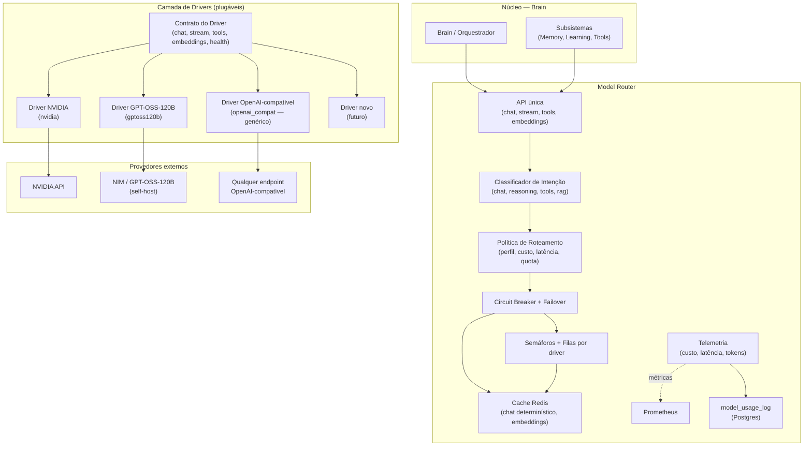
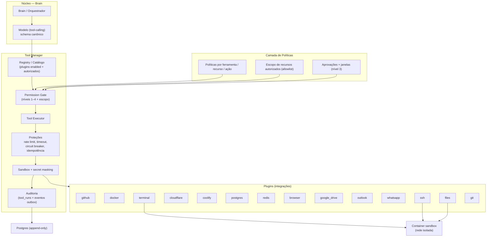
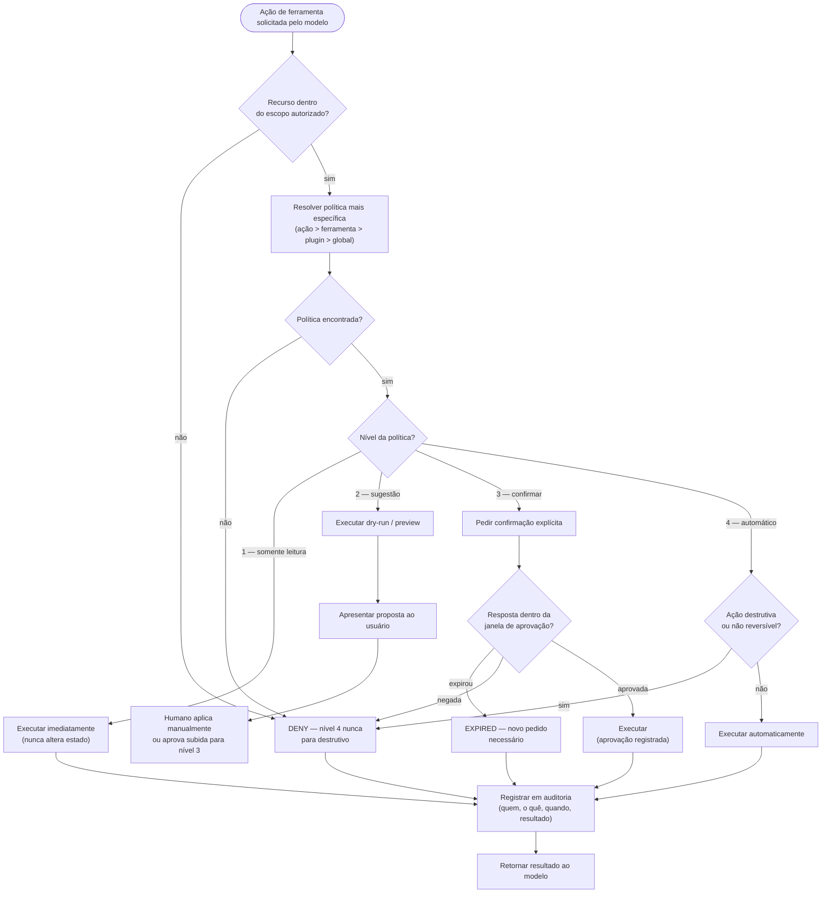
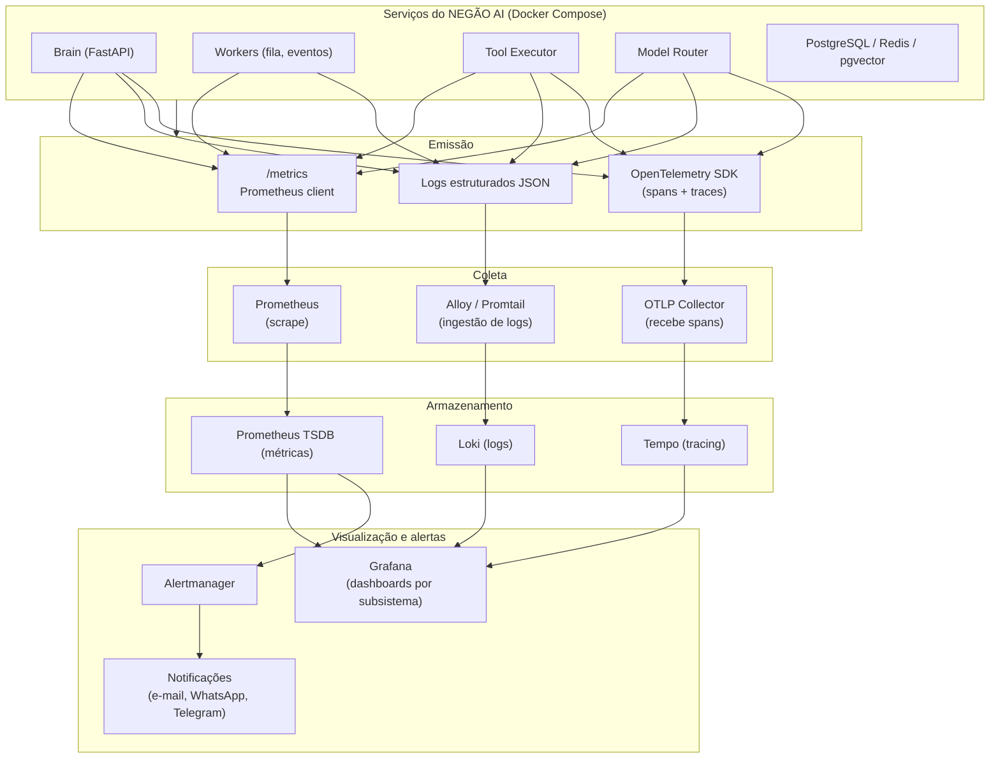

# NEGÃO AI — Arquitetura de Subsistemas

**Documento de Arquitetura — v1.0 (Desenho Conceitual)**
**Escopo:** Model Router, Tool Manager, Segurança e Autorização, Observabilidade, Banco de Dados, Event Bus.
**Restrição:** este documento é de DESIGN. Nenhum código de implementação, apenas contratos, decisões e diagramas.

---

## 0. Princípios Arquiteturais (base de todas as decisões)

| # | Princípio | Consequência |
|---|-----------|--------------|
| P1 | **Uma única inteligência.** O NEGÃO AI é um assistente pessoal único (estilo Jarvis), com um núcleo (Brain) orquestrando todos os subsistemas. Não existem múltiplos agentes concorrentes. | Um único processo Brain; estado global consistente; fila única de tarefas. |
| P2 | **Núcleo agnóstico de modelo.** Nenhuma chamada de LLM acontece fora do Model Router. | Trocar/adicionar modelo = adicionar driver. Zero impacto no Brain. |
| P3 | **Toda integração é um plugin.** O núcleo depende apenas de contratos (interfaces); nunca de SDKs de terceiros. | Integrações vivem em módulos plugáveis, com ciclo de vida, permissão e observabilidade próprias. |
| P4 | **Default-deny.** Nenhuma ação acontece sem política explícita. | Camada de autorização obrigatória em TODO fluxo de execução. |
| P5 | **Auditável por construção.** Toda ação relevante gera evento estruturado, imutável e com rastreabilidade. | Outbox pattern + tabelas append-only. |
| P6 | **Observável por padrão.** Cada subsistema emite métricas, logs estruturados e spans. | Prometheus + Loki + OpenTelemetry desde o dia 1. |
| P7 | **Dados do usuário são do usuário.** Criptografia em repouso, escopo explícito de recursos autorizados. | Secrets no Vault/Docker, criptografia AES-256-GCM, allowlist de recursos. |

---

## 1. MODEL ROUTER — Roteador de Modelos

### 1.1 Papel no sistema

O Model Router é o ÚNICO ponto de acesso do Brain (e de qualquer subsistema) aos modelos de linguagem. O Brain envia intenções de alto nível (chat, raciocínio, tool-calling, embeddings); o Router decide **qual driver**, **com qual estratégia** e **com quais proteções** atende a requisição.

### 1.2 Contrato de Driver (a interface central)

Todo modelo entra no sistema como um **Driver** que implementa este contrato (Protocol):

| Capacidade | Contrato (semântico) |
|------------|----------------------|
| `chat` | Conclui uma conversa (mensagens + parâmetros) e retorna a resposta completa. Entrada: histórico de mensagens (roles `system`, `user`, `assistant`, `tool`), temperatura, max_tokens, stop. Saída: texto + contagem de tokens (prompt/completion). |
| `chat_stream` | Mesma entrada, saída incremental: fluxo (iterator assíncrono) de chunks com eventos de delta, uso de tokens no final e sinal de término. |
| `tool_call` | Executa chamada de ferramenta: entrada = lista de tools (schema JSON) + mensagens; saída = intenção do modelo de chamar `tool_id` com `arguments` JSON, ou texto puro. Deve aceitar o resultado da ferramenta de volta (segunda volta). |
| `embeddings` | Converte lista de textos em vetores. Entrada: batch de strings. Saída: vetores (dimensão declarada pelo driver). |
| `health` | Reporta estado: `ok`, `degraded`, `down`, com latência de ping e informação de quota restante se exposta. |
| `capabilities` | Descreve: suporte a streaming, tool-calling, visão; tamanho da janela de contexto; custo por 1M tokens (input/output); modalidades; se é determinístico. |
| `cost_estimate` | Dado contagem de tokens, retorna custo estimado (USD). Usado para decisão de rota e orçamento. |

**Regras do contrato:**
- Todo driver é **assíncrono** (não bloqueia o event loop do Brain).
- Todo driver expõe **timeout próprio** configurável; o Router impõe um timeout de teto (ex.: `p95` do tipo de chamada + folga).
- O formato de `tool_call` é **normalizado pelo Router**: o driver traduz para o formato nativo do provedor e o Router converte de volta para o formato canônico. O Brain só conhece o formato canônico.
- Erros de driver são normalizados em taxonomia única: `QUOTA_EXCEEDED`, `RATE_LIMITED`, `TIMEOUT`, `CONNECTION`, `BAD_REQUEST`, `MODEL_DOWN`, `CONTEXT_OVERFLOW`.

### 1.3 Drivers concretos (primeira leva)

| Driver | Provedor | Como implementa o contrato |
|--------|----------|---------------------------|
| `nvidia` | NVIDIA API (build.nvidia.com / NIM endpoints) | Chat completions compatível com OpenAI (HTTP + SSE para streaming). Cobre qualquer modelo hospedado na plataforma. |
| `gptoss120b` | GPT-OSS-120B (self-host ou via NVIDIA NIM) | Mesmo formato OpenAI-compatível; endpoints de inferência próprios (localhost/VPS). Driver distinto porque: quotas, latências e fallback próprios. |
| `openai_compat` (genérico) | Qualquer API OpenAI-compatível | Driver genérico configurado por base_url + api_key. **90% dos modelos futuros entram sem escrever driver novo** — apenas um bloco de configuração declarativa. |

A regra de extensibilidade: **um modelo novo que fale o protocolo OpenAI é 100% configuração** (YAML); um modelo com protocolo proprietário exige um novo driver, mas o núcleo permanece intacto — isso é o Driver Pattern.

### 1.4 Registro e configuração declarativa de modelos

Cada modelo registrado no catálogo (`model_catalog`) declara:

- `id` canônico (ex.: `gpt-oss-120b`, `nvidia/llama-3.3-70b`), `driver` (ex.: `gptoss120b`), `aliases` (para o Brain não acoplar a nomes de provedor).
- `capabilities` efetivas (herdadas do driver + overrides).
- `routing_weight` (peso de seleção), `max_concurrency`, `queue_policy` (drop/block/queue).
- `cost` por 1M tokens (atualizável — usado em custo e roteamento).
- `fallbacks`: lista ordenada de modelos substitutos por tipo de falha (quota vs. timeout vs. down).
- `profile`: `flagship` (raciocínio, tool-calling complexo), `workhorse` (chat comum, custo médio), `cheap` (sumarização, tarefas triviais), `embedder`.

### 1.5 Fluxo de roteamento (decisão em camadas)

1. **Classificação da requisição** — o Brain marca a intenção: `chat`, `reasoning` (chain-of-thought, matemática), `tools` (exige tool-calling confiável), `rag` (contexto longo), `batch` (sem interação). 
2. **Filtro por capacidade** — candidatos = modelos com `capabilities` que atendem (ex.: tool-calling para `tools`; contexto ≥ X para `rag`).
3. **Seleção** — dentro do perfil alvo, seleção ponderada por (`custo`, `latência recente`, `quota`, `weight`). Regra típica: sempre o mais barato do perfil que atende; usa flagship só quando o perfil pede.
4. **Checks de proteção** — circuit breaker do driver fechado?, quota disponível?, concurrency disponível? Se não: consulta a cadeia de `fallbacks` do perfil.
5. **Execução** — com timeout, telemetria e cache (se aplicável).

### 1.6 Fallback e failover

- **Por erro específico**: `RATE_LIMITED`/`QUOTA_EXCEEDED` → próximo modelo da mesma categoria funcional; `TIMEOUT`/`MODEL_DOWN` → próximo da cadeia completa.
- **Failover de driver**: se o driver inteiro está `down` (health beacon negativo), o Router muda o peso do perfil para o driver alternativo (ex.: NVIDIA → GPT-OSS local ou vice-versa).
- **Degradação elegante**: se todos falham, o Router retorna erro tipado `ALL_MODELS_UNAVAILABLE` e o Brain decide (responder com cache, enfileirar, ou pedir desculpas informando indisponibilidade).
- **Circuit breaker por driver** (e por modelo): janela de observação (ex.: 60 s), limite de falhas (ex.: 5), estados `closed → open → half_open`. Enquanto `open`, a rota é desviada automaticamente. Métrica `router_circuit_state` expõe o estado.

### 1.7 Balanceamento e concorrência

- **Rate limit upstream** respeitado com semáforo por driver (`max_concurrency`) + fila FIFO com tempo máximo de espera (evita estouro de quota).
- **Seleção ponderada** por custo/latência quando há múltiplos candidatos equivalentes (não apenas round-robin: pesos dinâmicos penalizam modelo com latência p95 acima do alvo).
- **Roteamento por janela de contexto**: textos longos vão para modelo com janela maior; embeddings sempre vão para o `embedder`.

### 1.8 Cache de respostas (Redis)

- **Cache de chat**: só para requisições determinísticas (`temperature = 0`) e quando a política do fluxo permite. Chave canônica = SHA-256(modelo, mensagens, tools). TTL 24 h. Cache-busting por versão de modelo. **Nunca cacheia streaming interativo**.
- **Cache de embeddings**: chave = hash(texto, modelo). TTL 30 dias. Maior economia operacional (retrieval repetido).
- **Cache negativo**: falhas de quota/erro 429 têm cache curto (30–60 s) para não martelar o upstream.
- Métricas de hit/miss por modelo (`router_cache_hit_total`).

### 1.9 Observabilidade de custo e latência

- Métricas Prometheus por `{driver, model, profile}`: latência (histograma p50/p95/p99), tokens in/out, custo acumulado (counter em USD), erros por taxonomia, fallbacks acionados, cache hit/miss, circuit state.
- Persistência: tabela `model_usage_log` (um registro por chamada: driver, modelo, tokens, custo, latência, cache hit, perfil, erro). Alimenta dashboards de custo e a "conta" do assistente.
- **Orçamento**: alerta quando custo diário/mensal ultrapassa limite configurado (`CostBudgetExceeded`).

### 1.10 Como adicionar um modelo novo (sem tocar no núcleo)

1. Se o protocolo for OpenAI-compatível → bloco de configuração no catálogo (modelo, driver `openai_compat`, custos, perfil, fallbacks). Fim.
2. Se o protocolo for proprietário → novo módulo driver que implementa o contrato da seção 1.2 (sem depender do núcleo), registrado no catálogo.
3. Em qualquer caso: seeds/backfill de `model_catalog`, testes de capacidade (suite de smoke: chat, streaming, tools, embeddings), ajuste de pesos e fallbacks. Nenhuma linha do Brain muda.

**Decisões e justificativa:**
- *Driver Pattern + contrato mínimo:* extensibilidade sem acoplamento; o Brain enxerga um único objeto (Router).
- *Cache só determinístico:* evita respostas inconsistentes em temperatura > 0.
- *Fallback por cadeia de perfis:* o usuário sempre tem um modelo funcional mesmo com provedor em queda.
- *Catálogo declarativo:* configuração tratada como dados (migrável, versionável), não como código.

---

## 2. TOOL MANAGER — Gerente de Ferramentas (Plugins)

### 2.1 Princípio

**O núcleo NUNCA importa SDK de integração.** Toda integração (Git, GitHub, Docker, SSH, Cloudflare, Coolify, PostgreSQL, Redis, Browser, Drive, Outlook, WhatsApp, Terminal, Arquivos) é um **plugin** que se declara no Tool Manager e é chamado apenas pelo Executor, após a camada de permissão.

### 2.2 Contrato de Plugin (manifesto)

Todo plugin publica um manifesto com:

| Campo | Descrição |
|-------|-----------|
| `id` | Identificador único (ex.: `github`, `docker`, `terminal`). |
| `version` | Semver; quebra de contrato = bump major (registro preserva compatibilidade). |
| `description` | Texto usado pelo modelo para decidir quando chamar. |
| `auth_required` | Tipo de credencial: `api_key`, `oauth`, `ssh_key`, `none`. |
| `timeout_default` | Timeout padrão das operações (ex.: 15 s; GitOps: 60 s; Terminal: 120 s). |
| `rate_limit` | Limite padrão (ex.: 60 req/min por usuário). |
| `risk_profile` | `low` (leitura), `medium` (escrita não destrutiva), `high` (destrutiva/remota) — influencia o nível de autorização sugerido. |
| `capabilities` | Declaração de capacidades para descobrimento (ex.: `git_read`, `git_write`, `ci_trigger`). |
| `tools[]` | Ferramentas individuais (abaixo). |

Cada **ferramenta** do plugin declara o schema estilo *tool-calling* (o mesmo que será enviado ao modelo):

- `name` (único global: `namespace.tool`, ex.: `github.create_issue`)
- `description` (para o modelo entender quando e como usar)
- `parameters` — **JSON Schema** (draft 2020-12): tipos, required, enum, exemplos.
- `permission_hint`: sugestão de nível (`read` | `suggest` | `confirm` | `auto`) — a política final decide (seção 3).
- `idempotent`: se a ferramenta é segura para retry.
- `mutation`: `read` | `write` | `delete` | `exec` — usado pela camada de permissão e auditoria.

### 2.3 Registro e ciclo de vida

| Estado | Significado | Transições |
|--------|-------------|------------|
| `registered` | Manifesto carregado no catálogo, ainda não ativo. | → `enabled` |
| `enabled` | Disponível para o modelo (entra no tool-calling) e executável. | → `disabled`, `deprecated` |
| `disabled` | Fora do tool-calling; execuções pendentes são bloqueadas com mensagem clara. | → `enabled`, `deprecated` |
| `deprecated` | Não entra em tool-calling; execuções existentes permitidas com aviso; remoção após período de graça. | → `disabled` |

- **Registry**: catálogo em memória (carregado no boot) + espelho persistente em Postgres (`tool_plugins`). Atualizações dinâmicas por recarga declarativa (config versionada), sem restart do Brain.
- **Habilitação**: nunca automática; exige política de autorização (seção 3) e credencial válida. O catálogo expõe ao modelo apenas os plugins `enabled` e autorizados para aquele usuário.
- **Execução** — caminho obrigatório: `Tool Executor` com as seguintes proteções em ordem:
  1. **Permission Gate** (seção 3) — decide nível; só passa com autorização satisfeita.
  2. **Rate limit** — token bucket por `{usuário, ferramenta}` no Redis (ex.: 60/min, burst 10). Excedeu → resposta tipada `RATE_LIMITED` ao modelo (que tenta alternativa).
  3. **Timeout** — por ferramenta (do manifesto) com teto global de 120 s.
  4. **Circuit breaker** — por `{plugin, ferramenta}`: 5 falhas em 60 s → aberto 60 s → half-open. Evita que integração degradada derrube o Brain.
  5. **Idempotência/retry** — retry apenas se `idempotent=true` e com `request_id` idempotente; caso contrário, erro tipado para o modelo.
  6. **Sandbox** (seção 2.5) e **redação de segredos** no resultado (secret masking).
  7. **Auditoria** — registro completo em `tool_runs` (quem, o quê, argumentos mascarados, resultado, duração, custo, decisão de autorização).

### 2.4 Exemplos de plugins (catálogo inicial)

| Plugin | Ferramentas representativas | `mutation` típico | Nível sugerido | Credencial |
|--------|------------------------------|-------------------|----------------|------------|
| `git` | status, log, diff, commit, push, checkout | read / write / exec | read=1, commit=2, push=3 | SSH key local |
| `github` | list_repos, read_issue, create_issue, comment, create_pr, merge_pr, list_workflows, run_workflow | read / write | read=1, issue=2, merge=3, workflow_run=3 | OAuth GitHub (scopes mínimos: `repo`, `read:org`) |
| `docker` | ps, logs, inspect, build, run, stop, rm, prune | read / exec | read=1, build/run=3, rm/prune=3 | Socket docker (via container com permissão controlada) |
| `ssh` | exec comando em hosts autorizados, upload/download de arquivo | exec | sempre ≥3 (allowlist de hosts) | SSH keys por host, arquivo `authorized_hosts` |
| `cloudflare` | dns_lookup, purge_cache, list_zones, modify_dns, toggle_under_attack | read / write | read=1, purge=2, modify=3 | API token Cloudflare (escopo por zona autorizada) |
| `coolify` | list_apps, app_status, deploy, rollback, logs | read / exec | read=1, deploy=3, rollback=3 | API key Coolify |
| `postgres` | execute (somente `SELECT` por default), describe_table, list_tables, backup_dump | read / write | SELECT=1, DDL/escrita=3 (nunca 4) | Role `readonly` + role `admin` separadas |
| `redis` | get, scan_keys, ttl, monitor_usage, flush (bloqueado por default) | read / write | read=1, write=3, flush=bloqueado (policy deny) | Senha Redis |
| `browser` | open, navigate, screenshot, extract, click (com confirmação) | read / exec | navigate/extract=2, click/form=3 | Sessão headless |
| `google_drive` | list, search, read_file, upload, create_doc, share | read / write | read=1, upload=2, share=3 | OAuth Google (Drive scopes mínimos) |
| `outlook` | list_inbox, read_email, draft, send_email, calendar_events | read / write | read=1, draft=2, send=3 | OAuth Microsoft Graph |
| `whatsapp` | send_message, read_unread, list_chats | read / write | read=1, send=3 | Sessão/API autorizada |
| `terminal` | run (whitelist de comandos), execute_script | exec | whitelist read=1, resto ≥3 (sandbox container) | — |
| `files` | read, list, write, delete, move (raiz = diretório autorizado do usuário) | read / write / delete | read=1, write=2/3, delete=3 (nunca 4) | Escopo por paths permitidos |

Regra de ouro: **nenhum plugin tem `exec`/`delete` em nível 4** (execução automática) por padrão — políticas 4 só para leituras e ações triviais de baixo risco.

### 2.5 Sandboxing de execução

| Plugin | Estratégia de sandbox |
|--------|----------------------|
| `terminal`, `ssh`, `files`, `git` | Execução em **container descartável** (rede isolada ou `none`, sem mounts sensíveis, usuário não-root, tmpfs). Command whitelist por política. Paths restritos ao diretório autorizado. |
| Plugins HTTP/API (`github`, `cloudflare`, `coolify`, `google_drive`, `outlook`, `whatsapp`, `docker`) | Sem sandbox de processo (chamadas remotas): proteção via validação de input (JSON Schema), allowlist de recursos (repos/zones autorizadas), scopes OAuth mínimos e secret masking. |
| `postgres`, `redis` | Conexão dedicada com role restrita (`readonly` default; `admin` exige nível 3) e `statement_timeout` no servidor (matança de query longa). |

**Secret masking:** todo output que passa pelo Tool Manager tem padrões de segredo (api keys, tokens, senhas) mascarados antes de chegar ao modelo e aos logs.

### 2.6 Logs de auditoria de ferramentas

Toda execução gera registro em `tool_runs` + evento de domínio (via outbox): usuário, plugin, ferramenta, request_id, argumentos mascarados, saída truncada (resumo), status, duração, decisão de autorização (nível, aprovador, janela), custo. Imutável (append-only, particionado por mês — seção 5).

**Decisões e justificativa:**
- *Manifesto + JSON Schema:* o modelo já consome o mesmo schema no tool-calling; evita dupla modelagem.
- *Catálogo com estados:* habilitação controlada por política, nunca por presença de código.
- *Circuit breaker por ferramenta:* uma integração degradada não deve derrubar o assistente inteiro.
- *Sandbox por classe de plugin:* sandbox de processo só onde há execução local; API remota é protegida por scopes + allowlist.

---

## 3. SEGURANÇA E AUTORIZAÇÃO

### 3.1 Níveis de autorização por ação

| Nível | Nome | Comportamento | Exemplos |
|-------|------|---------------|----------|
| **1** | Somente leitura | Executa imediatamente, sem confirmação. Nunca altera estado externo. | `github.list_repos`, `git.status`, `files.read`, `postgres SELECT`, `docker.ps` |
| **2** | Sugestão | O NEGÃO AI executa em modo *dry-run/preview* e apresenta o resultado como proposta; o humano aplica manualmente (ou aprova a aplicação automática em 3). | `outlook.draft`, `cloudflare.purge_cache`, `git.commit` (proposto), `google_drive.upload` (preview) |
| **3** | Execução mediante confirmação | Executa somente após confirmação explícita do usuário (dentro da janela de aprovação). | `github.merge_pr`, `docker.run`, `terminal` (não-whitelist), `postgres` escrita, `whatsapp.send`, `files.delete` |
| **4** | Execução automática | Executa sem intervenção. **Concedido apenas por política explícita e revogável**; proibido para `delete`/destrutivo/remoto não reversível por padrão. | leituras recorrentes, agendamentos aprovados, rotinas de manutenção declaradas |

### 3.2 Modelo de políticas

```
POLÍTICA = (principal, recurso, ação) → NÍVEL + REGRAS
```

- **Default-deny**: ausência de política = negação (o modelo recebe erro tipado `PERMISSION_DENIED` e tenta alternativa lícita).
- **Hierarquia de precedência** (a mais específica vence):
  1. Política de ação específica (ex.: `files.delete` em `/home/user/secretos`) — negação ou nível.
  2. Política por ferramenta (ex.: `terminal` = nível 3).
  3. Política por plugin/recurso (ex.: plugin `ssh` = nível 3, somente hosts da allowlist).
  4. Política global do assistente (default: leitura=1, escrita=3, destrutivo=deny).
- **Escopo de recursos**: lista explícita de recursos autorizados por integração (repositórios, zonas Cloudflare, hosts SSH, diretórios de arquivos, bancos/roles). **Recurso fora da lista = deny automático** — o sistema nunca interage com o que não está autorizado.
- **Quem aprova**: o usuário dono (owner) por padrão; delegação opcional por política (ex.: membro da família aprova envio de e-mail, owner aprova ações destrutivas).
- **Janelas de aprovação**: pedido de confirmação válido por N minutos (default 15, configurável por política e por risco); expirado = novo pedido. A confirmação chega pelo canal ativo (WebSocket da sessão; fallback: e-mail/WhatsApp).
- **Denials**: registrados em auditoria; alimentam memória de preferências (o NEGÃO AI aprende a não repetir ações negadas sem aviso); nunca silenciosos.
- **Re-vocação imediata**: mudar política revoga aprovações pendentes daquele escopo.

### 3.3 Fluxo de decisão (resumo)

Requisição de ferramenta → resolve política mais específica → se recurso fora do escopo: DENY → se nível 1: executa → nível 2: produz sugestão → nível 3: enfileira pedido de confirmação (janela, canal, timeout) → nível 4: executa direto (com checagem de segurança adicional: destrutivo? → nunca) → resultado + auditoria. Ver Diagrama 6.3.

### 3.4 Autenticação

| Aspecto | Desenho |
|---------|---------|
| Usuários | Senhas com Argon2id (memória ≥ 64 MB, iterações ≥ 3). MFA (TOTP) opcional, recomendado. |
| Sessões | JWT Access Token (TTL 15 min, assinado RS256, claims: `sub`, `role`, `scope`) + Refresh Token (TTL 7 dias, **rotação**: cada uso emite novo; reuso detectado revoga a família → proteção anti-replay). |
| API Keys | Para integrações M2M (webhooks, clientes). Formato `ngk_` + 32 bytes; no banco somente hash (SHA-256); prefixo em texto claro para identificação. Escopos limitados por chave. |
| OAuth 2.0 | Google (Drive, Calendar, Gmail), Microsoft (Graph/Outlook), GitHub (repo). Authorization Code + PKCE; refresh token recebido é **criptografado em repouso** (AES-256-GCM). Scopes mínimos por integração. |
| Segredos | Chave mestra do app em **Docker secret / HashiCorp Vault** (fase 2). Segredos de integrações criptografados em repouso com **envelope encryption**: cada segredo tem Data Key AES-256-GCM aleatória, cifrada pela chave mestra (KEK). Nunca em texto claro no banco/logs. |
| Criptografia em repouso | Volume Postgres com LUKS/criptografia de disco; `pgcrypto` para colunas sensíveis quando aplicável; backups criptografados (chave separada). |

### 3.5 Auditoria completa

- Tabela `audit_events` (append-only, imutável por trigger que impede UPDATE/DELETE): **quem** (user, session, api_key, ou sistema), **o quê** (tipo de ação, entidade, payload mascarado), **quando** (timestamp com fuso, precisão ms), **resultado** (sucesso/falha/deny/timeout, código), **origem** (IP, device, canal), `request_id` correlacionando logs/traces.
- **Hash chain opcional** (coluna `prev_hash` SHA-256) para detecção de adulteração; processo noturno valida a cadeia.
- Retenção: 1 ano online (particionado mensal), depois arquivamento criptografado (3 anos).
- Correlação: `request_id` e `trace_id` em todas as camadas (logs + eventos + auditoria).

**Decisões e justificativa:**
- *4 níveis escaláveis:* balança autonomia vs. controle; usuário ajusta por ferramenta sem reescrever lógica.
- *Default-deny + escopo:* requisito do assistente pessoal: só age no que foi autorizado.
- *Refresh com rotação e reuso-detecta-revoga:* mitigação padrão da indústria contra roubo de token.
- *Envelope encryption:* chave mestra fora do banco; compromise de banco não expõe segredos.

---

## 4. MONITORAMENTO E OBSERVABILIDADE

### 4.1 Stack

| Camada | Ferramenta | Papel |
|--------|------------|-------|
| Métricas | **Prometheus** | Coleta pull de métricas (endpoint `/metrics` por serviço) |
| Dashboards | **Grafana** | Visualização, dashboards por subsistema, alarmes visuais |
| Logs | **Loki** (via Alloy/Promtail) | Logs estruturados JSON centralizados, com labels (`service`, `module`, `level`) |
| Tracing | **OpenTelemetry** + Collector → **Tempo** (ou Jaeger) | Traces distribuídos: requisição Brain → Router → driver → ferramenta → banco |
| Alertas | **Alertmanager** | Rotas, silêncios e notificações (e-mail/WhatsApp/Telegram) |
| Rastreamento de custo | Grafana + `model_usage_log` | Consumo por modelo/provedor |

### 4.2 Health checks

- `/healthz` (liveness): processo vivo — sempre 200 se o serviço responde.
- `/readyz` (readiness): dependências — Postgres (ping), Redis, pgvector/Qdrant, drivers de modelo (health beacon), fila. 503 com lista de dependências não prontas.
- Drivers expõem health próprio; o Router publica `driver_health` como métrica gauge.

### 4.3 Logs estruturados (JSON)

Um schema único em todas as camadas: `timestamp`, `level`, `service`, `module`, `request_id`, `trace_id`, `user_id` (pseudoanonimizado), `event`, `message`, `duration_ms`, `fields` (contexto específico). **Nunca** segredos (secret masking no producer). Níveis: `debug` (detallado, off em prod), `info` (fluxo), `warn` (degradação), `error` (falha com impacto), `audit` (ações).

### 4.4 Métricas-chave por subsistema

| Subsistema | Métricas essenciais |
|------------|---------------------|
| **Brain** | `brain_request_total{intent}` , `brain_request_duration_seconds{intent}` (p50/p95/p99), `brain_tokens_total{model}`, `brain_cost_usd_total{model}`, `brain_fallback_total`, `brain_context_tokens` (prevenção de overflow), `brain_sessions_active` |
| **Memory** | `memory_retrieval_duration_seconds`, `memory_hit_rate` (recuperação útil vs. chamadas), `memory_embeddings_total`, `memory_chunks_stored`, `memory_dedup_total` |
| **Learning** | `learning_events_total{type}` (preferências, negociações, correções), `learning_preference_changes_total`, `learning_training_duration_seconds` (se aplicável) |
| **Tools** | `tool_exec_total{tool,status}`, `tool_duration_seconds{tool}` , `tool_error_total{tool,error_type}`, `tool_rate_limited_total{tool}`, `tool_circuit_state{tool}`, `tool_approval_pending_total`, `tool_approval_timeout_total` |
| **Events** | `event_bus_produced_total`, `event_bus_consumed_total`, `event_bus_lag_seconds` (fila de eventos), `event_outbox_pending_total`, `event_dead_letter_total`, `event_processing_duration_seconds` |
| **Model Router** | `router_latency_seconds{model}` , `router_tokens_total{model}` , `router_cost_usd_total{model}`, `router_cache_hit_total{model}`, `router_circuit_state{driver}`, `router_quota_errors_total` |
| **Infra** | `ws_connections_active`, `queue_depth`, `db_connection_pool_usage`, `redis_latency_seconds`, `vault_unseal_status`, `disk_usage_bytes` |

### 4.5 Alertas recomendados (Alertmanager)

`DriverDown`, `ModelQuotaExceeded` (rotina), `CircuitOpen`, `ToolErrorRate > 5%`, `EventLag > 60s`, `OutboxBacklog > 100`, `MemoryHitRate < 30%`, `Disk > 80%`, `CostBudgetAlert` (diário/mensal), `RefreshTokenReuseDetected` (segurança — urgente), `AuthFailureRate > limiar` (possível ataque).

**Decisões e justificativa:**
- *Prometheus+Grafana+Loki+Tempo:* stack aberta padrão-ouro, sem vendor lock-in, fácil de rodar em Docker Compose na VPS.
- *Métricas por `{model, tool}` como dimensão:* permite responder "quanto custa o GPT-OSS hoje?" e "qual ferramenta está degradada?" sem rebuild.
- *Outbox lag como SLO:* mede saúde do event bus em tempo real.

---

## 5. BANCO DE DADOS

### 5.1 PostgreSQL — esquemas (domínios)

| Schema | Conteúdo |
|--------|----------|
| `identity` | Usuários, sessões, refresh tokens, api keys, credenciais OAuth, chaves criptográficas (envelope). |
| `memory` | Conversas, mensagens, embeddings, memória de longo prazo (fatos sobre o usuário), preferências. |
| `knowledge` | Documentos, fontes, chunks vetorizados, metadados (para RAG). |
| `events` | Eventos de domínio, outbox, auditoria, telemetria de modelo. |
| `scheduler` | Tarefas agendadas, execuções, recorrências. |
| `tools` | Plugins, ferramentas, políticas de autorização, aprovações, execuções (`tool_runs`), catálogo de modelos. |
| `config` | Configuração do assistente, feature flags, limites de orçamento, versionamento de configuração. |

### 5.2 Tabelas-chave com campos essenciais

**identity**
- `users` — id, username, email, password_hash (argon2id), role, mfa_enabled, created_at.
- `sessions` — id, user_id, refresh_token_hash, expires_at, revoked_at, family_id, user_agent, ip.
- `api_keys` — id, user_id, key_hash, prefix, scopes[], name, last_used_at, expires_at.
- `oauth_tokens` — id, user_id, provider, provider_user_id, access_token_cipher, refresh_token_cipher, scopes[], expires_at.
- `secrets` — id, name, data_key_cipher, payload_cipher, rotation_id, last_rotated_at.

**memory**
- `conversations` — id, user_id, title, status, created_at, updated_at.
- `messages` — id, conversation_id, role, content, model, tool_calls (jsonb), tokens_used, created_at. Índice (conversation_id, created_at).
- `message_embeddings` — id, message_id, model, embedding vector(3072), created_at. Índice vetorial HNSW.
- `long_term_memories` — id, user_id, fact, category, confidence, source_event_id, embedding vector(3072), created_at, updated_at.

**knowledge**
- `documents` — id, user_id, source_type, source_ref, title, checksum, status, created_at.
- `document_chunks` — id, document_id, chunk_index, content, embedding vector(3072), metadata jsonb, created_at. Índice HNSW + índice `document_id`.

**events** (particionado mensal por `created_at`)
- `domain_events` — id (uuid), event_type, aggregate_type, aggregate_id, payload jsonb, occurred_at, published_at (para outbox) — ver 5.7.
- `audit_events` — id, user_id, action_type, target_type, target_id, payload_masked jsonb, outcome, request_id, trace_id, ip, created_at. Append-only.
- `model_usage_log` — id, user_id, driver, model, profile, tokens_in, tokens_out, cost_usd, latency_ms, cache_hit, error_type, created_at.
- `tool_runs` — id, user_id, tool_id, request_id, args_masked jsonb, result_summary, status, duration_ms, auth_decision jsonb (nível, aprovador, janela), created_at.

**scheduler**
- `jobs` — id, name, cron, timezone, tool_action jsonb, policy_level, enabled, next_run_at, last_run_at.
- `job_runs` — id, job_id, started_at, finished_at, status, result_summary, error.

**tools**
- `tool_plugins` — id, plugin_id, version, manifest jsonb, status (registered/enabled/disabled/deprecated), auth_config_ref, created_at.
- `tools` — id, plugin_id, name, description, parameters_schema jsonb, permission_hint, mutation, idempotent, timeout_ms, rate_limit, enabled.
- `policies` — id, principal (user_id, role, ou *), resource_scope (plugin, tool, ação, path/repo específico), action, level (1–4 ou deny), window_minutes, approvals_required, priority, created_by, created_at, valid_from, valid_until.
- `approvals` — id, policy_id, tool_run_request_id, requested_by, requested_level, status (pending/approved/denied/expired), approved_by, decided_at, expires_at, channel.
- `model_catalog` — id, model_id, driver, profile, capabilities jsonb, cost_in_usd jsonb, routing_weight, max_concurrency, fallbacks jsonb, active.

**config**
- `settings` — key (PK), value jsonb, updated_by, updated_at, version.
- `feature_flags` — key, enabled, conditions jsonb.

### 5.3 Vetores: pgvector vs Qdrant

**Decisão: pgvector (fase 1) com interface de armazenamento de vetores isolada** (o código de retrieval depende de um contrato, nunca do banco). Justificativa:
- Um serviço a menos na VPS; transacional com os metadados (chunks/documentos na mesma transação); suficiente para catálogo pessoal (até ~1–5M vetores) com índice HNSW.
- Migração para Qdrant é **sem impacto no núcleo** (mesmo contrato), quando a escala/performance exigir. Esse é o caminho de evolução documentado.

### 5.4 Migrações (Alembic)

- Migrações versionadas por schema, em diretórios separados (`alembic/versions` + config por schema); ordem topológica de aplicação.
- Migração de índices vetoriais via extensão `pgvector` (CREATE INDEX HNSW) com `maintenance_work_mem` adequado.
- Política: migrações forward-only; rollback explícito manual (backup) — padrão em ambientes de assistente pessoal.

### 5.5 Particionamento, índices e retenção

- **Particionamento por RANGE (mensal)** em: `events.domain_events`, `events.audit_events`, `events.model_usage_log`, `events.tool_runs`, `scheduler.job_runs`. Criação de partições futuras via `pg_partman`.
- Índices-chave: `audit_events(user_id, created_at)`, `domain_events(event_type, occurred_at)`, `model_usage_log(model, created_at)`, `messages(conversation_id, created_at)`, vetores HNSW nas tabelas de embedding, `policies(resource_scope, action)`, `approvals(status, expires_at)`, `jobs(next_run_at)`.
- Retenção: eventos/telemetria 12 meses online → arquivamento; auditoria 12 meses → arquivamento criptografado 3 anos; memória/knowledge retidos (são o patrimônio do assistente).

### 5.6 Backup e PITR

- **pgBackRest**: backup full semanal + incremental diário + **archivamento contínuo de WAL** (point-in-time recovery).
- Retenção: 30 dias de PITR; teste de restore mensal automatizado (valida os backups).
- Backups criptografados com chave separada; armazenados em outro disco/remoção (VPS → object storage autorizado).
- Em caso de perda de dados: PITR para o último estado consistente + reindexação vetorial a partir de `knowledge`/`memory` (as embeddings são derivadas dos textos — reconstruíveis).

### 5.7 Redis — quais dados e por quê

| Domínio | Keyspace | Formato | TTL |
|---------|----------|---------|-----|
| Cache de respostas | `cache:chat:{sha256}` | JSON | 24 h |
| Cache de embeddings | `cache:emb:{sha256}` | vetor serializado | 30 d |
| Cache negativo (quota) | `cache:neg:{driver}` | JSON | 30–60 s |
| Rate limit | `ratelimit:{tool}:{user}` | contador (sliding window) | janela |
| Sessões WebSocket | `ws:session:{user_id}` | JSON (conn_id, canal ativo) | 24 h |
| Locks distribuídos | `lock:{kind}:{id}` | SET NX EX | 30 s + heartbeat |
| Filas de trabalho | `queue:{name}` | lista/stream (arq/RQ) | — |
| Event bus | `stream:events` | Redis Streams + consumer groups | — |
| Health beacon dos drivers | `hb:driver:{id}` | timestamp | 15 s |
| Política cache (hot) | `pol:{principal}:{scope}` | nível resolvido | 60 s (invalidação por versão) |

Redis é usado para **dados de curto prazo e coordenação**, nunca como fonte de verdade de negócio.

### 5.8 Event bus — outbox pattern

**Problema:** mudanças de banco devem gerar eventos (auditoria, memória, notificações, scheduling) sem perda nem dupla transação.

**Desenho:**
1. **Produtores** escrevem o evento na tabela `events.domain_events` **na mesma transação** do dado de negócio (estado `pending`). Ex.: executou `github.create_issue` → transação: grava `tool_runs` + evento `tool.executed` pending.
2. **Publicador** (processo leve, poll a cada 1 s) seleciona eventos `pending` com `FOR UPDATE SKIP LOCKED` (lote de 100), publica no Redis Stream `stream:events` (ou direct para consumidores locais), marca `published_at`.
3. **Consumidores** (grupos de consumo: Memory, Learning, Scheduler, Notifier, Metrics) leem o stream com `XREADGROUP` + `XACK`; processamento idempotente por `event_id` (dedupe em Redis `seen:event:{id}`).
4. Falhas de consumo → retry com backoff exponencial (3 tentativas) → **dead letter** `stream:events-dlq` (alerta via `event_dead_letter_total`).
5. **Garantias**: at-least-once + idempotência = effectively-once; nunca perde evento (outbox é a fonte da verdade de eventos até publicar).

**Decisões e justificativa:**
- *Outbox:* elimina o clássico problema transação-vs-mensagem (sem dual write).
- *Redis Streams:* suficiente para volume pessoal (milhares/s), com consumer groups e DLQ embutidos; Kafka fica como evolução futura sem mudar os contratos de produtor/consumidor.

---

## 6. DIAGRAMAS MERMAID

### 6.1 (a) Arquitetura do Model Router com drivers



### 6.2 (b) Tool Manager com plugins e camada de permissão



### 6.3 (c) Fluxo de decisão de autorização (4 níveis)



### 6.4 (d) Stack de observabilidade



### 6.5 (e) erDiagram do PostgreSQL

```mermaid
erDiagram
    users ||--o{ sessions : "possui"
    users ||--o{ api_keys : "possui"
    users ||--o{ oauth_tokens : "possui"
    users ||--o{ conversations : "inicia"
    conversations ||--o{ messages : "contém"
    messages ||--o| message_embeddings : "vetorizado"
    users ||--o{ long_term_memories : "acumula"
    users ||--o{ documents : "importa"
    documents ||--o{ document_chunks : "dividido em"
    users ||--o{ jobs : "agenda"
    jobs ||--o{ job_runs : "executa"
    tool_plugins ||--o{ tools : "expõe"
    tools ||--o{ tool_runs : "registra execução"
    policies ||--o{ approvals : "gera pedidos"
    users ||--o{ approvals : "decide"
    users ||--o{ audit_events : "gera registros"
    users ||--o{ model_usage_log : "consome"

    users {
        uuid id PK
        text username UK
        text email UK
        text password_hash
        text role
        boolean mfa_enabled
        timestamp created_at
    }
    sessions {
        uuid id PK
        uuid user_id FK
        text refresh_token_hash
        uuid family_id
        timestamp expires_at
        timestamp revoked_at
    }
    api_keys {
        uuid id PK
        uuid user_id FK
        text key_hash
        text prefix
        jsonb scopes
        timestamp expires_at
    }
    oauth_tokens {
        uuid id PK
        uuid user_id FK
        text provider
        text access_token_cipher
        text refresh_token_cipher
        jsonb scopes
    }
    conversations {
        uuid id PK
        uuid user_id FK
        text title
        text status
    }
    messages {
        bigint id PK
        uuid conversation_id FK
        text role
        text content
        jsonb tool_calls
        int tokens_used
        timestamp created_at
    }
    message_embeddings {
        bigint id PK
        bigint message_id FK
        text model
        vector embedding
    }
    long_term_memories {
        uuid id PK
        uuid user_id FK
        text fact
        text category
        float confidence
        vector embedding
    }
    documents {
        uuid id PK
        uuid user_id FK
        text source_type
        text source_ref
        text title
        text checksum
        text status
    }
    document_chunks {
        bigint id PK
        uuid document_id FK
        int chunk_index
        text content
        vector embedding
        jsonb metadata
    }
    domain_events {
        uuid id PK
        text event_type
        text aggregate_type
        text aggregate_id
        jsonb payload
        timestamp occurred_at
        timestamp published_at
    }
    audit_events {
        bigint id PK
        uuid user_id FK
        text action_type
        text target_type
        text target_id
        jsonb payload_masked
        text outcome
        uuid request_id
        timestamp created_at
    }
    model_usage_log {
        bigint id PK
        uuid user_id FK
        text driver
        text model
        text profile
        int tokens_in
        int tokens_out
        numeric cost_usd
        int latency_ms
        boolean cache_hit
    }
    jobs {
        uuid id PK
        uuid user_id FK
        text name
        text cron
        jsonb tool_action
        int policy_level
        timestamp next_run_at
    }
    job_runs {
        uuid id PK
        uuid job_id FK
        timestamp started_at
        timestamp finished_at
        text status
    }
    tool_plugins {
        uuid id PK
        text plugin_id UK
        text version
        jsonb manifest
        text status
    }
    tools {
        uuid id PK
        uuid plugin_id FK
        text name
        text description
        jsonb parameters_schema
        text permission_hint
        text mutation
        int timeout_ms
    }
    tool_runs {
        bigint id PK
        uuid user_id FK
        uuid tool_id FK
        uuid request_id
        jsonb args_masked
        text status
        int duration_ms
        jsonb auth_decision
        timestamp created_at
    }
    policies {
        uuid id PK
        text principal
        text resource_scope
        text action
        int level
        int window_minutes
        timestamp valid_until
    }
    approvals {
        uuid id PK
        uuid policy_id FK
        uuid user_id FK
        text status
        timestamp expires_at
        text channel
    }
```



---

## 7. Resumo das decisões críticas

| # | Decisão | Justificativa resumida |
|---|---------|------------------------|
| D1 | Model Router como único gateway de LLM com Driver Pattern | Extensibilidade sem tocar no núcleo; cache, custo e fallback em um só lugar |
| D2 | Tool Manager com plugins declarativos (JSON Schema) e camada de permissão | O núcleo nunca depende de integração; segurança no fluxo obrigatório |
| D3 | 4 níveis de autorização + default-deny + escopo explícito | Autonomia controlada; sistema age apenas no autorizado |
| D4 | Envelope encryption (AES-256-GCM) + Docker secrets/Vault | Segredos protegidos mesmo se o banco vazar |
| D5 | Outbox pattern no Postgres + Redis Streams | Consistência entre dados e eventos; effectively-once |
| D6 | pgvector fase 1 com contrato de retrieval isolado | Simplicidade inicial; Qdrant como evolução sem refatorar núcleo |
| D7 | Particionamento mensal em eventos/auditoria/telemetria | Crescimento controlado; arquivamento simples por partição |
| D8 | pgBackRest com WAL e PITR | Restauração pontual garantida; embeddings reconstruíveis |
| D9 | Stack Prometheus/Grafana/Loki/Tempo/Alertmanager | Padrão de mercado, open source, roda na VPS em Docker |
| D10 | Auditoria append-only com hash chain | Detecção de adulteração e rastreabilidade total |

---

## 8. Caminho de evolução (fases)

1. **Fase 1 (MVP):** Brain + Model Router (drivers NVIDIA/GPT-OSS/OpenAI-compat) + Tool Manager (git, github, terminal, files, postgres, docker) + autorização 4 níveis + auditoria + Prometheus/Grafana/Loki + pgvector + outbox.
2. **Fase 2:** plugins restantes (ssh, cloudflare, coolify, browser, drive, outlook, whatsapp), Vault, MFA, hash chain, alertas avançados.
3. **Fase 3:** Qdrant (se escala exigir), Kafka (se volume exigir), dashboards de custo por modelo, aprendizado de preferências integrado à memória.
