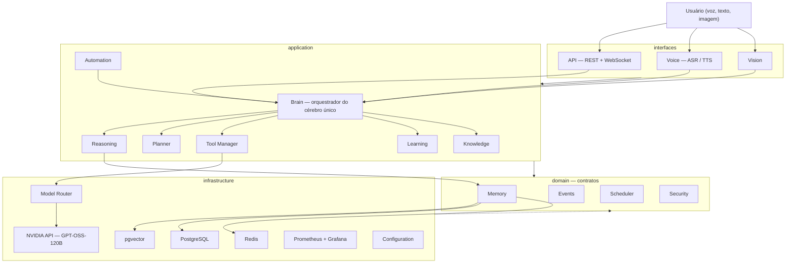

# NEGÃO AI — ARQUITETURA MESTRE (Documento Oficial v1.0)

> **Escopo:** Arquitetura completa do NEGÃO AI — uma única inteligência, uma única memória, um único cérebro.
> **Status:** Aprovado para revisão — aguardando validação do usuário.
> **Nenhum código foi escrito.** Este documento é a base para a implementação.

---

## Índice da documentação

| # | Item obrigatório | Resumo | Detalhamento |
|---|---|---|---|
| 1 | Arquitetura completa | Clean Architecture em 4 camadas + Cérebro Único | [ARQUITETURA-CORE-MODULOS.md](./ARQUITETURA-CORE-MODULOS.md) |
| 2 | Estrutura de diretórios | Monorepo: backend / frontend / infra / docs / tests | [ARQUITETURA-CORE-MODULOS.md §2](./ARQUITETURA-CORE-MODULOS.md) |
| 3 | Módulos | 17 módulos, responsabilidade única | [ARQUITETURA-CORE-MODULOS.md §3](./ARQUITETURA-CORE-MODULOS.md) |
| 4 | Comunicação entre módulos | RPC síncrono (Brain) + Event Bus assíncrono | [ARQUITETURA-CORE-MODULOS.md §4](./ARQUITETURA-CORE-MODULOS.md) |
| 5 | Sistema de memória | Curto (Redis) / Longo (PostgreSQL) / Vetorial (pgvector) | [ARQUITETURA-MEMORIA-APRENDIZADO-KNOWLEDGE.md](./ARQUITETURA-MEMORIA-APRENDIZADO-KNOWLEDGE.md) |
| 6 | Sistema de aprendizado | Pipeline contínuo: analisar → resumir → classificar → relacionar → salvar | [ARQUITETURA-MEMORIA-APRENDIZADO-KNOWLEDGE.md §3](./ARQUITETURA-MEMORIA-APRENDIZADO-KNOWLEDGE.md) |
| 7 | Knowledge Vault | Conhecimento curado: docs, projetos, código, decisões | [ARQUITETURA-MEMORIA-APRENDIZADO-KNOWLEDGE.md §4](./ARQUITETURA-MEMORIA-APRENDIZADO-KNOWLEDGE.md) |
| 8 | Tool Manager | Plugins desacoplados do núcleo + permissões | [ARQUITETURA.md §2](./ARQUITETURA.md) |
| 9 | Model Router | Drivers plugáveis (NVIDIA API, GPT-OSS-120B, futuros) | [ARQUITETURA.md §1](./ARQUITETURA.md) |
| 10 | Autenticação e autorização | JWT + API keys + 4 níveis de autorização + auditoria | [ARQUITETURA.md §3](./ARQUITETURA.md) |
| 11 | Monitoramento | Prometheus, Grafana, Loki, OpenTelemetry | [ARQUITETURA.md §4](./ARQUITETURA.md) |
| 12 | Banco de dados | PostgreSQL (7 schemas), Redis, pgvector, outbox | [ARQUITETURA.md §5](./ARQUITETURA.md) |
| 13 | Fluxo de eventos | Envelope, versionamento, catálogo de eventos | [ARQUITETURA-CORE-MODULOS.md §4](./ARQUITETURA-CORE-MODULOS.md) |
| 14 | Diagramas Mermaid | 4 + 4 + 5 + gantt = 14 diagramas nos documentos | ver abaixo |
| 15 | Roadmap por versões | v0.x → v6.0+ (2026–2036) | [ROADMAP.md](./ROADMAP.md) |

---

## 1. Princípio Fundamental: Cérebro Único

O NEGÃO **não é** um chatbot, **não é** um conjunto de agentes. É **uma** inteligência com:

- **Uma** personalidade (não existe system prompt por módulo)
- **Uma** memória (todos os módulos leem/escrevem a mesma Memory)
- **Um** orquestrador (somente o Brain enxerga o ciclo completo de um pedido)

**Regra de ouro:** *nenhum módulo chama outro módulo diretamente.* Existem apenas 2 caminhos de comunicação:

1. **RPC interno síncrono** — o Brain invoca módulos de application via `router.py` de cada um.
2. **Eventos assíncronos** — qualquer módulo publica/consome eventos; produtor e consumidor não se conhecem.

---

## 2. Decisões Arquiteturais-Chave (resumo)

| Decisão | Escolha | Motivo |
|---|---|---|
| Camadas | Clean Architecture (interfaces → application → domain ← infrastructure) | Baixo acoplamento, testabilidade, evolução de 10 anos |
| Comunicação interna | RPC síncrono via Brain + Event Bus (Redis Streams) | Caminho crítico rápido; aprendizado assíncrono |
| Memória vetorial | **pgvector** (não Qdrant) | 1 banco só, backup único, custo operacional menor; Qdrant vira adaptador plugável futuro |
| Event Bus v1 | Redis Streams com envelope versionado | Sem broker extra na fundação; contrato permite troca por Kafka/RabbitMQ no K8s |
| Embeddings | BGE-M3 (denso + esparso) com HNSW halfvec + rerank cross-encoder | Precisão de recall com custo aceitável na VPS |
| Retrieval de memória | Score ponderado: 0,45 semântica + 0,20 relevância + 0,15 confiança + 0,15 recência + 0,05 uso | Resgate humanizado, prioriza o que importa |
| Modelos | Model Router com driver pattern | Zero lock-in; fallback automático; métricas de custo por modelo |
| Segurança | Default-deny, 4 níveis de autorização, auditoria append-only com hash chain | Toda ação é registrada e auditável |
| Deploy | Docker Compose → VPS Linux → K8s (v5) | Progressão natural sem overengineering |

---

## 3. Roadmap Resumido (detalhes em [ROADMAP.md](./ROADMAP.md))

| Versão | Tema | Período | Resumo |
|---|---|---|---|
| v0.x | Fundação | ago–nov/2026 | Infra, API, banco, eventos, observabilidade, deploy |
| v1.0 | Núcleo Vivo | dez/2026–mai/2027 | Conversa natural, Model Router, memória, planner básico, dashboard |
| v2.0 | Cérebro que Aprende | jun/2027–jan/2028 | Aprendizado contínuo, Knowledge Vault, agendador, automações simples |
| v3.0 | Mãos | fev–nov/2028 | Tool Manager, plugins, autorização granular com confirmação |
| v4.0 | Sentidos | dez/2028–nov/2029 | Voz, visão, observação de ambiente, multimodalidade |
| v5.0 | Maturidade | dez/2029–mai/2031 | Autonomia validada, K8s, multi-usuário, custo otimizado |
| v6.0+ | Evolução Contínua | 2031–2036 | Auto-melhoria, metacognição, inteligência ambiental 24/7 |

---

## 4. Como ler este conjunto de documentos

1. **Comece por este documento** — visão geral e mapa.
2. **[ARQUITETURA-CORE-MODULOS.md](./ARQUITETURA-CORE-MODULOS.md)** — camadas, 17 módulos, diretórios, event bus, ciclo de vida de um pedido.
3. **[ARQUITETURA-MEMORIA-APRENDIZADO-KNOWLEDGE.md](./ARQUITETURA-MEMORIA-APRENDIZADO-KNOWLEDGE.md)** — memória de 3 níveis, aprendizado contínuo, Knowledge Vault.
4. **[ARQUITETURA.md](./ARQUITETURA.md)** — Model Router, Tool Manager, segurança, observabilidade, banco de dados.
5. **[ROADMAP.md](./ROADMAP.md)** — versões, milestones semanais da v1.0, KPIs e critérios de aceitação.

---

## 5. Próximos passos (após aprovação)

1. Aprovação deste documento (ou ajustes solicitados).
2. Gerar ADRs (Architecture Decision Records) para cada decisão-chave.
3. Definir backlog técnico da v0.x (issues por milestone).
4. `git init` + estrutura inicial do monorepo (somente esqueleto).
